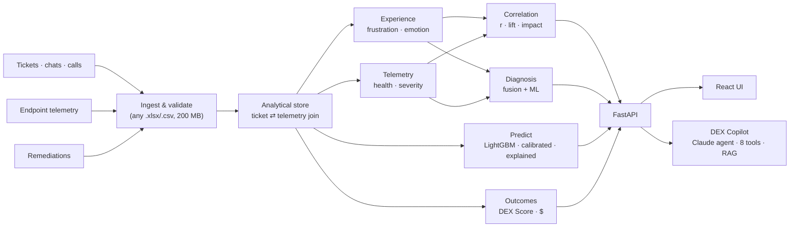

# DEX Sentinel: Jury Pitch

**Fix it before they call.**

DEX Sentinel links what employees *say* to the service desk with what their laptops are *doing*. It uses that link to diagnose problems in seconds, predict who will struggle next week, and prove with numbers that a fix improved someone's working day.

> Every number in this document comes from the running application and can be reproduced live. The data is simulated (no real employee data), and the benchmark is seeded so the jury can regenerate it.

---

## 1. The 30-second pitch

> Today the IT service desk waits for the angry call. By then the employee has already lost hours. Tickets are "closed" when people stop calling, not when their laptop works.
>
> DEX Sentinel reads every ticket, chat and call for frustration and joins it to the device's telemetry. That combination explains frustration with a correlation of **0.83**. From it we built a machine-learning model that spots the employees who will have a bad week **before they pick up the phone**. It catches **72%** of next week's frustrated tickets from just the top 5% of devices, against **49%** for today's rules. It tells the engineer *why*, *what to fix* and *what it's worth*. After the fix, it measures whether the experience recovered: **+36.9%** on the DEX Score across 46 fixes.
>
> Fuse the signal. Predict the pain. Fix it first. Prove it worked.

---

## 2. The problem, in numbers from the app

| What happens today | What the data shows |
|---|---|
| Frustration and telemetry live in separate tools | Joined, they move together: **r = 0.83** between ticket frustration and device telemetry severity |
| Slow devices silently cost goodwill | Boot times over 85 s carry **1.9×** the frustration of fast-booting devices; latency 1.9×, app hangs 1.8× |
| Policy drift quietly generates tickets | Non-compliant device-weeks raise a login ticket **28.5%** of the time, against **0%** when compliant |
| "Closed" is not "fixed" | Before remediation, **46.8%** of contacts were repeats. After a verified fix, **0.7%** |
| The desk only reacts | In the benchmark fleet, **~106 frustrated tickets** are coming next week. Rules see about half of them in advance; the model sees about three-quarters |

---

## 3. What makes DEX Sentinel different: four moves

| | Move | What it does | Why the jury should care |
|---|---|---|---|
| 1 | **Fuse** | Scores the frustration in every ticket (explainable lexicon, 93.3% validated) and joins it to that device's telemetry for the same week | Neither signal is enough alone. Together they explain the experience |
| 2 | **Diagnose** | Ranks five root causes by fusing telemetry severity (65%) with ticket language (35%), then drills to sub-causes, evidence and a runbook fix. ML gives a second opinion | "My laptop is slow" becomes "boot degradation, breached 3 of 4 weeks, reimage per KB-PERF-001" in one click |
| 3 | **Predict** *(new)* | A LightGBM model reads telemetry **trends**, recent experience and device profile to forecast next week's frustrated tickets. It explains every prediction and prices the fix | The service desk goes from reactive to proactive, with a ranked, explained, costed to-do list |
| 4 | **Prove** | Measures before vs after on every fix (frustration, repeat contacts, ticket rate, DEX Score) and converts the change into dollars | Leadership funds what is proven to work, measured by employee experience rather than SLA ticks |

The **DEX Copilot** sits on top: an agentic LLM (Claude) that answers questions in business language. It may only quote numbers it fetched from the engines through 8 tools, and it falls back to a fully offline grounded engine when no key is set.

---

## 4. Proof points scoreboard

**Predictive model: reproducible benchmark** (5,000 devices × 26 weeks, seed 7). This is an out-of-time backtest: the model is only ever scored on weeks it never saw.

| If the desk acts on the top 5% of devices each week | ML model | Today's rules |
|---|---|---|
| **Next-week frustrated tickets caught in advance** | **72.3%** | 48.8% |
| Flagged devices that really did raise one (precision) | **39.5%** | 26.7% |
| Ranking quality for rare events (PR-AUC) | **0.455** | 0.250 |
| ROC-AUC | **0.957** | 0.929 |

- **Calibrated:** when the model says 25%, it happens 25.6% of the time.
- **Explained:** every prediction lists its drivers, for example *"Boot duration 108.9s, +61.3s over 3 wks; breached 3 of last 4 wks"*.
- **Valuable:** acting on the top 50 devices is worth about **$3,699 a week** in avoided tickets and lost time (**~$192k/yr** if sustained) at default, editable cost assumptions.
- **Robust:** on a different 2,600-device dataset the model still catches **2×** what the rules catch.

**Platform**

| Proof | Value |
|---|---|
| Remediation outcomes | 45 of 46 fixes improved; frustration 69.0 → 58.2; tickets/week 0.41 → 0.15; DEX 64.0 → 87.6 (**+36.9%**) |
| Business value of past fixes | **~$114,734 per year** |
| Scale | 163 MB upload (2.34 M device-weeks) analysed and live in **~80 s** |
| Quality | **81 automated tests**, including golden tests on every published figure, a no-leakage test for the model, and a test that ML beats rules on unseen weeks |
| Works offline | No API key needed; the LLM only improves the Copilot's wording |

---

## 5. Five-minute talk track (live demo)

Open **http://localhost:5173** with the 5,000-device benchmark loaded (see the checklist in section 11).

| Time | Screen | Do this | Say this |
|---|---|---|---|
| 0:00–0:30 | *(no screen)* | Face the panel | "Every IT team has two sources of truth about the employee experience, and they never meet: what people *say*, and what their devices *do*. We joined them, and then we taught the system to see the next problem coming." |
| 0:30–1:10 | **Executive Dashboard** | Point at the DEX Score, Correlation Score and the insight cards | "One outcome number for leadership. Frustration tracks telemetry at r = 0.83, so what employees say is a reliable signal. This insight is new: *185 devices are likely to raise a frustrated ticket next week.*" |
| 1:10–2:10 | **Proactive Watchlist** | Point at the KPI row, then the Model-vs-Rules card, then the top rows of the table | "This is the service desk's to-do list for Monday morning. On unseen weeks the model catches **72%** of next week's frustrated tickets from the top 5% of devices; today's rules catch 49%. Every row says *why*, the likely cause, the runbook fix and what acting is worth: about $3,700 this week for the top 50." |
| 2:10–2:50 | **Device 360 → DEV-2462** | Click the top row. Show the risk panel, the risk history, then the boot-time chart | "Tom's boot time climbed 61 seconds in three weeks. The model's risk went from 0% to 74% *before* he called. His first ticket, in week 26, says *'This is urgent, I'm losing hours to this every week.'* We could have fixed it the week before." |
| 2:50–3:30 | **Diagnosis Assist** | From Device 360 click **Diagnose latest ticket** | "When a ticket does arrive, one click fuses the text with telemetry: Performance, boot degradation, 99% confidence, boot 108.9 s against a fleet median of 31 s, breached 3 of the last 4 weeks. The fix is a reimage per KB-PERF-001, with the expected outcome taken from past fixes. The ML second opinion agrees." |
| 3:30–4:10 | **DEX Copilot** | Ask *"Which devices will struggle next week and what should we do?"* | "Leaders can just ask. The Copilot calls the prediction tool, fleet overview and outcomes, and cites them. Every number is fetched, not invented. It works without an AI key too." |
| 4:10–4:40 | **Outcome Reporting** | Show improved cases and recovery by category | "And we close the loop: 45 of 46 fixes improved the experience, repeat contacts dropped from 47% to under 1%, and the DEX Score recovered 37%. Tickets aren't closed until the experience is." |
| 4:40–5:00 | *(back to the panel)* | — | "Fuse the signal. Predict the pain. Fix it first. Prove it worked. That's DEX Sentinel." |

**If you have two extra minutes:** show **Upload Dataset**. Drop CSVs, click *Submit for Analysis*, watch the stages run, and every screen refreshes, including a freshly retrained model.

---

## 6. Architecture in one picture

**Stack:** Python (FastAPI, pandas, SciPy, scikit-learn, LightGBM), React + TypeScript, SQLite/Postgres, Claude or Azure OpenAI (optional), Docker, Google Cloud Run.

### Responsible AI, by design

| Principle | How it's built in |
|---|---|
| **Explainable** | Rule scores trace to phrases and thresholds; every ML prediction lists its exact feature contributions |
| **Measured, not asserted** | ML is always shown next to the rule baseline it has to beat, on unseen weeks |
| **Calibrated** | Risk % is fitted to observed outcomes (isotonic), so 30% means 30% |
| **Honest about data** | Low-sample banners, `n=` beside small averages, a simulated-data disclosure everywhere |
| **Grounded LLM** | The Copilot may only state numbers returned by tools, and it cites its sources |
| **Private** | Runs fully offline; `DEX_MASK_PII` pseudonymises names; no employee data leaves the server |
| **Human in the loop** | The model ranks and recommends; an engineer confirms with Diagnosis Assist before acting |

---

## 7. Business impact

| Lever | How DEX Sentinel moves it | Evidence in the app |
|---|---|---|
| **Fewer tickets** | Fix the device before the call; verified fixes stop repeat contacts | Tickets/week 0.41 → 0.15 after fixes; watchlist avoidable tickets |
| **Productive hours back** | Less time lost to slow boots, drops and crashes | Productivity hours recovered (Outcome Reporting) |
| **Faster diagnosis** | Root cause, evidence and runbook in one click | Diagnosis Assist, Copilot |
| **Smarter investment** | Fund the fixes proven to recover experience | Recovery % by root cause; impact ranking |
| **Happier employees** | Problems fixed before they become complaints | DEX Score and Experience Index trend |

**How the dollars are computed** (all assumptions editable in Settings): tickets avoided × cost per ticket ($22), plus resolution hours × 50% productivity loss × $55/h. The watchlist value multiplies each device's risk by the historical ticket-rate reduction of its recommended fix.

---

## 8. How we meet the judging criteria

| Criterion | Our evidence |
|---|---|
| **Innovation** | The ticket-to-telemetry join, and *predictive* DEX: forecasting frustration from telemetry trends, with explanations and a price tag |
| **Technical depth** | Correlation matrix with p-values; fused root-cause engine; LightGBM with leakage-safe features, rolling-origin backtest, isotonic calibration and exact contributions; agentic LLM with tools, RAG and a structured schema |
| **Impact** | 72% vs 49% of frustrated tickets caught ahead of time; +36.9% experience recovery; ~$115k/yr proven value, plus ~$3.7k/week proactive value |
| **Feasibility and scale** | Upload any .xlsx/.csv (column names auto-mapped); 163 MB analysed in ~80 s; Docker + Cloud Run deployment; offline mode |
| **User experience** | One-click drill-down from dashboard to watchlist to device to diagnosis to Copilot; every chart has a table view; dark and light themes; colour-blind-safe palette |
| **Completeness and quality** | 12 screens, 38 API endpoints, 81 automated tests, full documentation ([documentation.md](../documentation.md)) |

---

## 9. Questions the jury will ask, and crisp answers

**"Your data is simulated. Why should we believe the numbers?"**
The simulator is seeded, so you can regenerate the exact dataset. It hides a latent degradation state and a per-employee tolerance that the model can't see, so the task is realistic rather than trivial. The model is only ever scored on weeks it hasn't seen, and it is compared with the rule baseline on the same weeks. On real data the same backtest reruns automatically after every upload.

**"Isn't 72% just overfitting?"**
No. The evaluation is out-of-time: the model trains on weeks before *k* and is scored on week *k*, never the reverse. An automated test changes every future week and checks that the model's inputs don't change, which proves there is no leakage.

**"Why not deep learning or an LLM for prediction?"**
For weekly tabular telemetry, gradient-boosted trees are the state of the art. They are fast (about 30 s to retrain on 130,000 device-weeks), accurate, and give exact per-feature explanations. We use the LLM where it is strongest: explaining results to people in business language.

**"What happens with a small customer or little history?"**
The model refuses to predict without at least 6 weeks and 30 frustrated tickets, and says why. Below 200 examples it shows a low-sample warning. The explainable rules keep working regardless.

**"How does this plug into our tools?"**
Today: upload exports from any ITSM or DEX platform; column names such as *Short Description* or *Configuration Item* are recognised automatically. Next: live ServiceNow, Intune and Nexthink connectors, and ITSM write-back.

**"What about privacy?"**
Everything runs on your server, and it works fully offline. Names can be pseudonymised. The optional LLM receives only the aggregates that its tools return.

**"What does it cost to run?"**
It is a single container. The demo runs on one Cloud Run instance that scales to zero, and the LLM is optional.

**"Isn't this just correlation?"**
We say so explicitly. Drivers explain the model's reasoning, and Diagnosis Assist confirms the cause before a fix. Then Outcome Reporting measures whether the fix worked, which is the evidence that matters.

---

## 10. Roadmap and our ask

1. **Live connectors:** ServiceNow, Intune Endpoint Analytics, Nexthink, and Teams/telephony transcripts.
2. **AI text understanding:** Claude-labelled training data plus a local embedding model, multilingual, keeping the lexicon as a fallback.
3. **Closed-loop automation:** one-click proactive fix scripts for high-risk devices, with Copilot-drafted change notes and human approval.
4. **Causal proof:** matched control groups to measure the true uplift of each fix type.
5. **Learning from feedback:** technicians accept or reject watchlist items, and the model retrains on the result.

**Our ask:** a pilot with one business unit's real ticket and telemetry exports. The built-in backtest will report the real-world accuracy in the first week.

> **Closing line:** "The best ticket is the one that never had to be raised. DEX Sentinel sees it coming, fixes it first and proves it worked."

---

## 11. Pre-demo checklist

- [ ] Start the app: `.\run.ps1 -Dev -Port 8010` (UI http://localhost:5173, API http://127.0.0.1:8010/docs).
- [ ] Load the benchmark: `cd backend; ..\.venv\Scripts\python -m app.data.simulator --devices 5000 --weeks 26 --seed 7 --out ..\data\sim`, then **Upload Dataset** → the 4 CSVs → **Submit for Analysis**.
- [ ] **Warm the model:** open **Proactive Watchlist** once, about 30 s after upload, so it loads instantly during the demo.
- [ ] Check that DEV-2462 is at the top of the watchlist, and open its Device 360 once.
- [ ] Remote judges: `ngrok http 5173` and share the fresh link; any `*.ngrok-free.app` host is allowed.
- [ ] Optional: set `ANTHROPIC_API_KEY` for richer Copilot answers; the offline engine works without it.
- [ ] Backup: take screenshots of the Watchlist, Device 360 (DEV-2462) and Outcomes in case of network problems.
- [ ] After the demo: **Upload Dataset → Restore sample dataset** returns to the bundled data.
