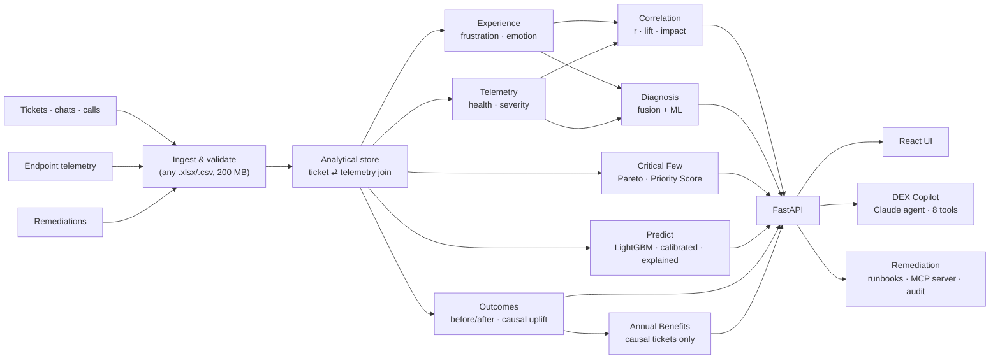

# DEX Sentinel: Jury Pitch

**Fix it before they call. Prove it worked.**

DEX Sentinel links what employees *say* to the service desk with what their laptops are *doing*. It uses that link to find the few issues behind most of the pain, predict who will struggle next week, fix it with a human approving, and prove, against a control group, what the fix really changed.

> For a technical audience, see [TECHNICAL_BRIEF.md](TECHNICAL_BRIEF.md): architecture, every formula with worked examples, and the technical FAQ.
>
> Every number here comes from the running application on the demo dataset (2,600 devices, 9,435 tickets, 694 fixes, 12 weeks) and can be reproduced live. The data is simulated: no real employee data.

---

## 1. The 30-second pitch

> Today the IT service desk waits for the angry call, and a ticket is "closed" when people stop calling, not when their laptop works.
>
> DEX Sentinel reads every ticket for frustration and joins it to that device's telemetry. The two move together (**r = 0.79**). From that join it shows the **critical few**: **7 of 16 issue types account for 85%** of lost time, frustration, cost and incidents. It predicts next week's frustrated tickets at **2× the hit rate of today's rules**, fixes the device through an approved, audited runbook, and then does what no dashboard does: it measures the fix against **matched devices that were never fixed**. Fixes cause **83% of the drop in frustration**, and we only count the part of the ticket drop they really cause.
>
> Find the few. Predict the pain. Fix it first. Prove what it caused.

---

## 2. Why now

- **DEX has become a budget line.** Hybrid work moved the office onto the laptop and the home network, and digital employee experience is now its own analyst category and a board-level topic for IT leaders.
- **Service-desk metrics measure the desk, not the employee.** SLA and ticket-closure KPIs look green while people keep losing hours.
- **Tools see one side.** Endpoint tools see devices; ITSM tools see tickets; survey tools see sentiment occasionally. Almost nobody joins the words in the ticket to the device's week, and nobody proves the fix *caused* the improvement.

---

## 3. The problem, in numbers from the app

| What happens today | What the data shows |
|---|---|
| Frustration and telemetry live in separate tools | Joined, they move together: **r = 0.79** between ticket frustration and device telemetry severity |
| Effort is spread thin | **7 of 16 issue types (44%) account for 85%** of the combined impact; the top 4 alone account for 67–72% of each measure |
| "Closed" is not "fixed" | Before remediation **59%** of contacts were repeats; after a fix, **6%** |
| Before/after flatters every fix | Matched never-fixed devices calm down too: only **13%** of the ticket drop is caused by the fix, but **83%** of the frustration drop is |
| The desk only reacts | **~22 frustrated tickets** are forecast for next week; the model catches twice what the rules catch, on weeks it never saw |

---

## 4. What makes DEX Sentinel different: five moves

| | Move | What it does | Why the jury should care |
|---|---|---|---|
| 1 | **Fuse** | Scores the frustration in every ticket and joins it to that device's telemetry for the same week | Neither signal is enough alone; together they explain the experience |
| 2 | **Prioritise (80/20)** | Traces every ticket to an issue type (root cause → sub-cause) and scores each: **Priority = Productivity + Cost + Employee + Risk impact** (0–25 each) | Leaders fund the critical few, not the trivial many |
| 3 | **Predict** | A LightGBM model reads telemetry *trends*, recent experience and device profile to forecast next week's frustrated tickets, explains every prediction and prices the fix | The desk goes from reactive to proactive |
| 4 | **Fix, safely** | One-click runbooks and email-driven software removal: dry run → named human approver → single-use token bound to the reviewed plan → per-device rollback → hash-chained audit. Also exposed to AI agents as an **MCP server** | Automation a CISO can sign off: the agent can plan, never approve itself |
| 5 | **Prove, causally** | Before vs after on every fix, then **difference-in-differences against the 5 closest never-fixed devices**, with a 95% interval | Most tools report the naive drop; we report what the fix caused, and ROI uses only that |

The **DEX Copilot** (Claude, agentic, 8 read-only tools) answers questions in business language. It may only quote numbers it fetched from the engines, and it falls back to an offline grounded engine without an API key.

---

## 5. Proof points scoreboard (demo dataset)

**Prediction: out-of-time backtest** (scored only on weeks the model never saw, against today's rule-based flagging at the same number of flagged devices)

| | ML model | Today's rules |
|---|---|---|
| Next-week frustrated tickets caught in advance | **32.6%** | 16.8% |
| Flagged devices that really did raise one (precision) | **21.9%** | 11.3% |
| Ranking quality for rare events (PR-AUC) | **0.495** | 0.170 |
| ROC-AUC | **0.896** | 0.851 |

On the larger 5,000-device × 26-week benchmark (seed 7) the same model catches **72%** vs **49%** for the rules; more history, better model.

**Causal proof of fixes** (694 fixes, 1,906 never-fixed devices in the control pool)

| Per device-week | Naive before/after | Would have happened anyway | **Caused by the fix** (95% CI) |
|---|---|---|---|
| Tickets | −0.67 | −0.58 | **−0.09** (−0.10 to −0.07) |
| Frustration burden | −53.3 | −9.0 | **−44.2** (−45.6 to −42.9) |

Every root cause's effect is significant on both measures.

**Value** (every dollar figure is labelled by kind in the app)

| Kind | Figure | Where |
|---|---|---|
| **Realised** | **$720K / year** ($701K data-backed): ticket cost + productivity recovery + license + hardware refresh, counting only causal tickets | Value & Priorities → Annual Benefits |
| Planned | $77K / year and DEX 80.0 → 84.3 from the top 3 fixes | Command Center |
| Preventable | $502K / year by fixing the 7 critical-few issue types | Value & Priorities → Critical Few |

**Platform**

| Proof | Value |
|---|---|
| Outcomes | 674 of 694 fixes improved; repeat contacts 59% → 6%; DEX 58.7 → 86.9 on the fixed devices |
| Speed | Every heavy view answers in under 0.2 s after a ~40 s start-up warm-up |
| Scale | 163 MB upload (2.34 M device-weeks) analysed and live in ~80 s |
| Quality | **134 automated tests**: golden tests on published figures, a no-leakage test for the model, causal-uplift invariants, approval-bypass tests |
| Works offline | No API key needed; the LLM only improves the Copilot's wording |

---

## 6. Seven-minute talk track (live demo)

Open the app with the demo dataset loaded and warmed (checklist in section 12).

| Time | Screen | Do this | Say this |
|---|---|---|---|
| 0:00–0:30 | *(no screen)* | Face the panel | "Every IT team has two truths about the employee experience that never meet: what people *say*, and what their devices *do*. We joined them, and then we taught the system to prove what a fix really changed." |
| 0:30–1:15 | **Command Center** | Read the headline; point at DEX Score, the prediction, Annual Benefits (*Realised* chip), then *The plan* | "One sentence tells leadership where we are: **22 frustrated tickets are coming next week; fixing three things moves DEX from 80 to 84.** Every dollar on screen says what kind it is: realised, planned or preventable." |
| 1:15–2:15 | **Value & Priorities → Critical Few · 80/20** | Click the four tiles; show the Pareto chart and the ranking | "**7 of 16 issue types account for 85% of the pain.** Each gets a Priority Score: productivity, cost, employee and risk impact, 25 points each, with the problem, the future risk, the fix and its value in one row. This is where the budget goes." |
| 2:15–3:00 | **Proactive Watchlist** | Point at *Model vs Rules*, then the top rows | "On weeks it never saw, the model catches **twice** what today's rules catch, with the same number of devices flagged. Every row says *why*, the likely cause and the runbook." |
| 3:00–4:00 | **Device 360 → DEV-02011** | Open Amara's row (fix pending): risk panel, drivers, telemetry | "Amara has raised three tickets in four weeks, one at the maximum frustration score, and her disk health is sliding. The model has her near the top of next week's list, and tells us why. One click diagnoses her latest ticket against her telemetry: replace the disk and restore her data." |
| 4:00–5:00 | **Fix now** (Device 360 or a Critical Few row) | Dry-run plan → type an approver's name → *Approve & run* | "The runbook is high-risk, so it needs a **named human**, a **single-use token** and the **exact plan that was reviewed**; the AI agent can plan but can never approve itself. Failed devices roll back, and every step is in a hash-chained audit trail. Execution is simulated in this demo." |
| 5:00–6:00 | **See the proven outcome** → **Outcomes** | Click the drawer's link; show *Did the fix cause it?* | "Here's the honest part. Fixed devices raise fewer tickets, but matched devices that were never fixed calm down too. The fix caused **13%** of the ticket drop and **83%** of the frustration drop, with 95% intervals. Most tools would show you the naive number. We use only the causal one." |
| 6:00–6:40 | **Value & Priorities → Annual Benefits** | Show the headline, then one formula card | "**$720K a year, realised**, and each line shows its formula, its inputs and whether the data or an assumption backs it. Change any input and it recalculates live." |
| 6:40–7:00 | *(back to the panel)* | — | "Find the few. Predict the pain. Fix it first. Prove what it caused. That's DEX Sentinel." |

**If you have two extra minutes:** show the **DEX Copilot** ("Which devices will struggle next week and what should we do?"), or **Upload Dataset**: drop CSVs, watch the stages run, and every screen refreshes with a retrained model.

---

## 7. Architecture in one picture

**Stack:** Python (FastAPI, pandas, NumPy, SciPy, scikit-learn, LightGBM), React + TypeScript, SQLite/Postgres, MCP, Claude or Azure OpenAI (optional), Docker, Google Cloud Run.

### Responsible AI, by design

| Principle | How it's built in |
|---|---|
| **Explainable** | Rule scores trace to phrases and thresholds; every ML prediction lists its feature contributions; every figure has a "How was this computed?" panel |
| **Measured, not asserted** | ML is shown next to the rule baseline it has to beat, on unseen weeks; fixes are measured against a control group |
| **Honest about data** | Naive vs causal side by side; text-model scores flagged as an upper bound on templated simulated tickets; low-sample warnings |
| **Human in the loop** | High-risk actions need a named human approver bound to the reviewed plan; agents and service identities are refused as approvers |
| **Grounded LLM** | The Copilot may only state numbers returned by its tools, and it cites them |
| **Private** | Runs fully offline; `DEX_MASK_PII` pseudonymises names; no employee data has to leave the server |

---

## 8. How we compare

Based on public product descriptions; check current feature lists before quoting them.

| Capability | Endpoint DEX tools (e.g. Nexthink, 1E/Tanium) | ServiceNow DEX | Microsoft Intune Endpoint Analytics | **DEX Sentinel** |
|---|---|---|---|---|
| Device telemetry | Yes (own agent) | Yes | Yes (Windows) | Yes (any export) |
| Employee sentiment | Surveys / campaigns | Surveys | No | **The ticket's own words, every ticket** |
| Ticket ⇄ telemetry join per device-week | Partial | Partial | No | **Core** |
| Next-week prediction, explained and priced | Limited | Limited | No | **Yes, backtested vs rules** |
| 80/20 Priority Score across 4 impacts | No | No | No | **Yes** |
| Causal proof of fix impact (control group) | No | No | No | **Yes** |
| Agent-ready remediation (MCP) with human approval | Scripts / workflows | Workflows | Remediation scripts | **Yes, plan-bound approvals** |

Our position: we **complement** these platforms. They are the data sources; DEX Sentinel is the layer that joins words to telemetry, prioritises, predicts and proves.

---

## 9. How we meet the judging criteria

| Criterion | Our evidence |
|---|---|
| **Innovation** | Ticket-language ⇄ telemetry fusion; predictive DEX; an 80/20 Priority Score; causal proof of every fix type |
| **Technical depth** | Correlation matrix with p-values; fused root-cause engine; LightGBM with leakage-safe features, rolling-origin backtest, calibration and exact contributions; difference-in-differences with matched controls and bootstrap intervals; agentic LLM with tools; MCP server with plan-bound approvals |
| **Impact** | $720K/yr realised (causal); $502K/yr preventable in 7 issue types; 2× the rules' hit rate on next week's frustration |
| **Feasibility and scale** | Upload any .xlsx/.csv (column names auto-mapped); 163 MB in ~80 s; sub-0.2 s views; Docker + Cloud Run; offline mode |
| **User experience** | One clicked chain: Command Center → Critical Few → Watchlist → Device 360 → Fix now → proven outcome; every chart has a table view; dark and light themes; colour-blind-safe palette |
| **Completeness and quality** | 14 screens, 58 API endpoints, 134 automated tests, full documentation ([documentation.md](../documentation.md)) |

---

## 10. Questions the jury will ask, and crisp answers

**"Your data is simulated. Why should we believe the numbers?"**
The simulator is seeded, so anyone can regenerate the data. It hides a latent degradation state and a per-employee tolerance that the model can't see. The model is only scored on weeks it hasn't seen, against the rule baseline on the same weeks. After every upload the same backtest and the same causal analysis rerun on the new data.

**"Isn't the text model's accuracy suspiciously high?"**
Yes, and we say so on screen. The simulated tickets are written from a few sentence templates per category, so text-based scores are an upper bound. That's why we lead with the telemetry-driven forecast and the out-of-time backtest, not the text classifier.

**"Isn't this just correlation? Maybe devices get better on their own."**
Exactly the right question, and many of them do. We compare every fixed device with its 5 closest never-fixed look-alikes over the same weeks (difference-in-differences). Only 13% of the ticket drop survives that test; 83% of the frustration drop does. ROI counts only the causal part.

**"Can the AI agent go rogue with remediation?"**
No. It can plan, but execution needs a named human approver, a single-use token and the hash of the exact plan that was reviewed; "agent", "Claude" or the service account are refused as approvers. Devices roll back on failure, and every step is in a hash-chained audit trail. In this demo execution is simulated.

**"Isn't 32.6% recall low?"**
It's twice what today's rules catch with the same number of flagged devices, on a rare event (about 1 in 17 device-weeks). On the longer benchmark it reaches 72%, because the model learns from trends and more history helps.

**"How is this different from Nexthink or ServiceNow DEX?"**
They collect telemetry and run sentiment surveys. We read the frustration in every ticket, join it to the device's week, prioritise with an 80/20 Priority Score, and prove fixes causally. We sit on top of them as data sources.

**"How does this plug into our tools?"**
Today: upload exports from any ITSM or DEX platform; columns such as *Short Description* or *Configuration Item* are recognised automatically. The remediation layer speaks MCP, so any agent platform can call it. Next: live ServiceNow, Intune and Nexthink connectors.

**"What about privacy?"**
Everything runs on your server, and it works fully offline. Names can be pseudonymised. The optional LLM only sees what its tools return.

---

## 11. Risks and limitations (say them before the jury does)

| Risk | Status | Mitigation |
|---|---|---|
| Simulated data | All numbers are on simulated data | Pilot on one business unit's real exports; the backtest and causal analysis rerun automatically |
| Simulated execution | Runbooks and removals don't touch real devices | Steps are the exact Intune / ConfigMgr commands; the approval, rollback and audit are real |
| Causal assumptions | Difference-in-differences assumes fixed and matched devices would have trended alike | Matched on the same degraded signal and ticket history; balance shown on screen (0.91 vs 0.84 tickets/week before the fix) |
| Productivity value | Minutes saved come from boot and hang changes on fixed devices, without a control group | Shown as a separate, editable line; tickets are counted causally |
| Email-driven removal | A spoofed sender could request a removal | Allow-listed senders, a human approver and a reviewed plan are all required; DKIM/SPF checks are on the roadmap |

---

## 12. Roadmap and our ask

1. **Live connectors:** ServiceNow, Intune Endpoint Analytics, Nexthink, and Teams/telephony transcripts.
2. **AI text understanding:** LLM-labelled training data and a local embedding model, multilingual, keeping the lexicon as a fallback.
3. **Closed-loop learning:** executed fixes feed post-fix telemetry back into Outcomes, and the forecaster retrains on technicians' accept/reject feedback.
4. **Stronger causal proof:** staggered roll-outs (randomised fix order) and per-fix-type uplift over longer windows.
5. **Enterprise approvals:** approvals signed by a separate approver identity, DKIM/SPF-verified request emails, and an externally anchored audit log.

**Our ask:** a pilot with one business unit's real ticket and telemetry exports *[name the target account]*. In the first week the built-in backtest and causal analysis will report real-world accuracy and real fix impact.

**Team:** *[names and roles]*

> **Closing line:** "The best ticket is the one that never had to be raised. DEX Sentinel sees it coming, fixes it first, and proves what the fix really changed."

---

## 13. Pre-demo checklist

- [ ] Start the app: `.\run.ps1 -Dev -Port 8010` (UI http://localhost:5173, API http://127.0.0.1:8010/docs), with the demo dataset (2,600 devices) loaded.
- [ ] Run the pre-demo check: `.venv\Scripts\python scripts\predemo_check.py --api http://127.0.0.1:8010`. It waits for the warm-up, times every demo view and prints the headline numbers to say out loud. Every view should be under 1 s.
- [ ] Check the **demo device** the script prints (DEV-02011 at the time of writing): the highest-risk device whose fix is still pending. Devices already fixed show *fix applied* instead of a Fix now button.
- [ ] Fix Now executions are recorded: rehearse on a Critical Few row you won't show live, or use **Upload Dataset → Restore** and re-upload the demo data afterwards.
- [ ] Remote judges: `ngrok http 5173` and share the fresh link; any `*.ngrok-free.app` host is allowed.
- [ ] Optional: set `ANTHROPIC_API_KEY` for richer Copilot answers; the offline engine works without it.
- [ ] Backup: screenshots of every talk-track screen are in [docs/demo-backup/](demo-backup/), in case of network problems.
