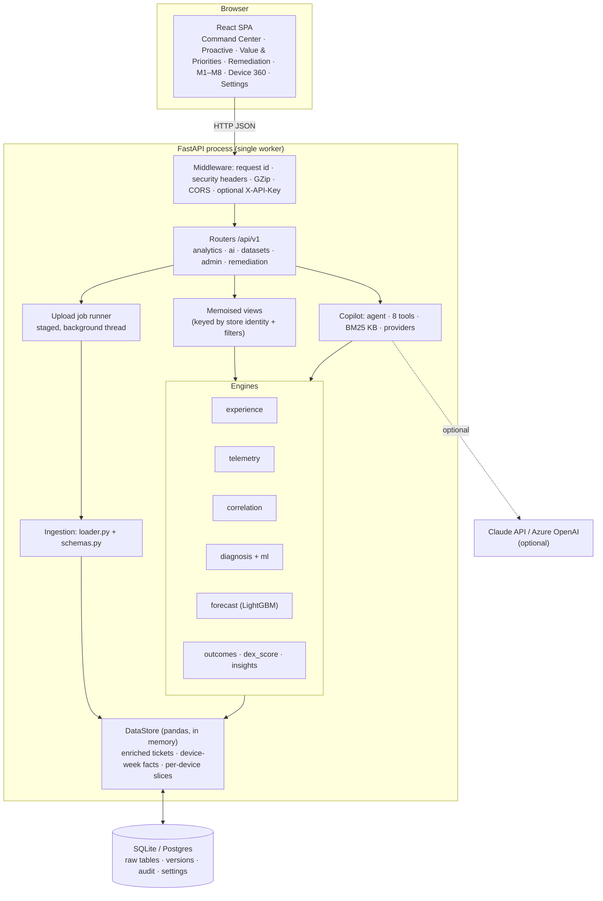

# DEX Sentinel: Technical Brief

*For engineers, architects and data scientists. Covers the problem, the solution design, the tech stack, the architecture, every metric and score, how it's validated, and the questions a technical audience usually asks.*

Related documents: [documentation.md](../documentation.md) (full reference) · [PITCH.md](PITCH.md) (business pitch) · [SOLUTION.md](SOLUTION.md) (hackathon write-up) · live API docs at `/docs`.

> All data is simulated. The bundled sample is 260 devices × 12 weeks; the benchmark is 5,000 devices × 26 weeks, seeded and reproducible.

---

## 1. Problem statement

**The brief:** correlate *subjective* employee-experience signals (service-desk calls, ticket language, frustration, repeat contacts) with *objective* endpoint telemetry (boot duration, application hangs, network quality, policy state, hardware health). Use the result to improve **diagnosis**, **remediation** and **outcome-based reporting**.

**Why that is hard in practice:**

| Challenge | Detail |
|---|---|
| **Two grains** | Tickets are events with free text; telemetry is a device × week time series. They have to be joined in time without leaking future information. |
| **Unstructured human signal** | Frustration lives in wording ("third time I'm reporting this"), repeat behaviour and escalations, not in a field. |
| **Rare target events** | A frustrated ticket occurs in about 2% of device-weeks, so accuracy is meaningless and ranking metrics are needed. |
| **Messy real exports** | ServiceNow/Intune/Nexthink exports differ in column names, date formats, grain (daily vs weekly) and completeness. |
| **Explainability** | Service-desk engineers and leadership won't act on a black-box number. Every score must trace back to evidence. |
| **Reactive operating model** | The desk only learns about a problem when the employee calls, by which time hours are already lost. |
| **"Closed" ≠ "fixed"** | Ticket closure and SLA metrics don't show whether the experience actually recovered. |

---

## 2. Proposed solution

Four capabilities in a pipeline, plus a grounded AI assistant:

| Step | Capability | How it works | Main files |
|---|---|---|---|
| 1 | **Fuse** | Score each ticket's frustration (lexicon + behaviour) and join it to that device's telemetry at the ticket week (`merge_asof`, backward) | `engines/experience.py`, `data/store.py` |
| 2 | **Diagnose** | Fuse telemetry severity (65%) with ticket-text category signal (35%) into five ranked root causes, then sub-cause rules, evidence and a runbook fix. A logistic-regression second opinion is shown alongside | `engines/diagnosis.py`, `engines/ml.py` |
| 3 | **Predict** | LightGBM forecasts next week's frustrated ticket per device from telemetry trends, with calibrated risk, drivers, fix and value | `engines/forecast.py` |
| 4 | **Prove** | Before/after metrics per remediation, the DEX Score, Experience Recovery % and $ impact | `engines/outcomes.py`, `engines/dex_score.py` |
| + | **Copilot** | Agentic LLM (Claude / Azure OpenAI) restricted to 8 tools and BM25 RAG over 22 runbooks, with an offline grounded template fallback | `copilot/*` |

**Design principles:**
1. **Explainable first.** Rules and statistics are the primary engines, and every score traces to phrases, thresholds or feature contributions.
2. **ML must earn its place.** Each model is reported next to the rule baseline it replaces, on held-out data.
3. **Offline-capable.** No external service is required; the LLM only improves the wording of answers.
4. **Safe data changes.** A new dataset is built off to the side and swapped in atomically, so a bad upload never breaks the live one.
5. **Honest reporting.** Low-sample flags, `n=` next to small averages, and simulated-data disclosure throughout.

---

## 3. Tech stack

### 3.1 Backend

| Technology | Version | Role | Why it was chosen |
|---|---|---|---|
| Python | 3.11+ (tested on 3.14) | All analytics and AI | Mature data/ML ecosystem |
| FastAPI | 0.141 | REST API, validation, OpenAPI at `/docs` | Type-driven validation, async, auto-docs |
| Uvicorn / Hypercorn | 0.54 / 0.18 | ASGI servers (dev / container) | Hypercorn serves HTTP/2 cleartext, which lifts Cloud Run's 32 MiB HTTP/1 request cap for 200 MB uploads |
| Pydantic + pydantic-settings | 2.13 / 2.15 | Request models, env-based config (`DEX_*`) | Strict input limits and patterns |
| pandas | 3.0 | Analytical store, joins, aggregations | Vectorised tabular work; `merge_asof` for the temporal join |
| NumPy | 2.5 | Vectorised numerics | Speed at millions of rows |
| SciPy | 1.18 | Pearson, Spearman, t-distribution p-values | Standard statistical library |
| scikit-learn | 1.9 | TF-IDF, logistic regression, CV, isotonic calibration, metrics | Well-tested, explainable models |
| LightGBM | 4.7 | Predictive risk model | State of the art for tabular data, fast, native categoricals, exact contributions via `pred_contrib` |
| SQLAlchemy + SQLite | 2.1 | Dataset, versions, audit logs, settings | Zero-ops locally (WAL mode); Postgres via `DEX_DATABASE_URL` |
| openpyxl + python-calamine | 3.1 / 0.8 | Excel ingestion | Calamine is about 9× faster on large workbooks |
| anthropic / openai SDKs | 1.9 / 3.20 | Optional LLM providers | Claude (default) or Azure OpenAI |

### 3.2 AI / ML components

| Component | Technique | Explainability |
|---|---|---|
| Sentiment and frustration | Weighted keyword lexicon plus behavioural boost (validated 93.3% vs a hidden ground-truth tier) | Matched phrases and their weights |
| Emotion | Lexicon → Anger / Frustration / Anxiety / Inquiry / Neutral distribution | Phrase hits |
| Correlation | Pearson, Spearman, t-test p-values, bucket lift, incidence lift | Full matrix with `n` per cell |
| Root cause (primary) | 65/35 telemetry-text fusion plus sub-cause rules | Evidence lines with thresholds and fleet medians |
| Root cause (second opinion) | Multinomial logistic regression on TF-IDF (1–2-grams) + standardised telemetry | Top positive feature contributions |
| **Predictive risk** | **LightGBM + isotonic calibration** | Exact per-feature contributions grouped into drivers |
| RAG | Hand-written Okapi BM25 (k1 = 1.5, b = 0.75) over runbook sections, with category (×1.35) and sub-cause (×1.8) boosts | Cited article IDs |
| Copilot | Tool-use agent (≤ 8 steps), JSON-schema output, Claude `claude-opus-5-5` or Azure OpenAI; deterministic template fallback | Tool trace plus citations |

### 3.3 Frontend

| Technology | Version | Role |
|---|---|---|
| React | 18.3 | SPA with 14 screens |
| TypeScript | 5.6 | Type safety |
| Vite | 5.4 | Dev server (proxies `/api`, `/docs` to the API; allows ngrok hosts) and build |
| TanStack Query | 5 | Caching, `keepPreviousData`, invalidation after uploads |
| React Router | 6 | Routing; the global filters live in the URL |
| Recharts | 2.15 | Charts; every chart also has a table view |
| lucide-react, react-markdown | 0.460 / 9 | Icons; rendering Copilot answers and runbooks |
| Custom CSS design system | — | Dark and light themes; colour-blind-safe palette ("teal = machine, amber = human") |

### 3.4 Delivery and tooling

| Tool | Role |
|---|---|
| `run.ps1` / `run.sh` | One-command install, build and run (`-Dev`, `-Port`, `-Test`) |
| Dockerfile | Multi-stage: Node 22 builds the UI; Python 3.13-slim + libgomp1 serves API + UI through Hypercorn |
| `deploy/gcp/` | Cloud Run (asia-south1): scale-to-zero, secrets in Secret Manager, HTTP/2 |
| pytest + httpx | 134 automated tests |
| `app.data.simulator` | Seeded benchmark data generator |
| ngrok | Sharing the local demo |

---

## 4. Architecture

### 4.1 Layered view



### 4.2 Component responsibilities

| Layer | Responsibility | Key implementation details | Files |
|---|---|---|---|
| **Ingestion** | Turn arbitrary exports into canonical tables | Header-row detection, sheet/table detection by alias score, column alias mapping, date → week, daily → weekly roll-up, derivation of missing fields, a `LoadReport` of every change | `data/loader.py`, `data/schemas.py` |
| **Analytical store** | Analysis-ready, immutable snapshot | Ticket ⇄ telemetry `merge_asof` (backward, by device), per-category severities, device-week fact table, positional per-device slices for O(1) lookups, derived pre/post remediation metrics | `data/store.py` |
| **Persistence** | Durable dataset and audit trail | Raw tables, dataset versions, diagnosis and Copilot logs, settings overrides; SQLite WAL | `db.py` |
| **Jobs** | Uploads without request timeouts | One running job at a time; stages received → read → validate → sentiment → correlate → outcomes → publish; atomic `replace_store`; background warm-up afterwards | `data/jobs.py` |
| **Engines** | Pure functions over DataFrames | Vectorised; unmeasured signals treated as "not measured", never zero | `engines/*.py` |
| **Models** | Train once per dataset | `get_model(store)` / `get_forecaster(store)` cache keyed by `id(store)` behind a lock, trained at start-up and after uploads | `engines/ml.py`, `engines/forecast.py` |
| **Copilot** | Grounded natural-language answers | Provider resolution (auto → anthropic → azure → template); tool loop; schema normalisation; fallback on any provider error or refusal | `copilot/agent.py`, `tools.py`, `provider_*.py`, `retriever.py` |
| **API** | Contract and safety | `CleanRoute` JSON-safe responses (NaN → null), Pydantic limits, `X-API-Key` compared with `secrets.compare_digest`, JSON 404/500 with request id | `api/*.py`, `main.py` |
| **UI** | Presentation | URL-backed filters, React Query caching, lazy-loaded pages | `frontend/src/**` |

### 4.3 Request lifecycle (example: Proactive Watchlist)

1. Browser → `GET /api/v1/forecast/watchlist?top=50` (in dev, Vite on :5173 proxies it to the API on :8010).
2. The middleware assigns a request id, checks the API key if one is configured, and later adds the security headers.
3. The router calls `get_forecaster(store)` in a threadpool. It returns the cached model, or trains it once (about 20–30 s on 130k device-weeks).
4. `Forecaster.watchlist()` ranks the latest-week risks, explains the top N, maps the strongest driver to a fix, and computes the value with the settings-driven cost model.
5. `CleanRoute` serialises the result, GZip compresses it, and React Query caches it for 60 s.

### 4.4 Deployment topologies

| Mode | Topology |
|---|---|
| **Dev / demo** | `run.ps1 -Dev -Port 8010`: Vite :5173 (HMR, proxy, ngrok-friendly) → Uvicorn :8010 |
| **Local production** | `run.ps1`: UI built into `frontend/dist`, served by FastAPI from the same origin |
| **Container / Cloud Run** | One image, Hypercorn HTTP/2 on `$PORT`, 1 worker (all state in-process), max 1 instance, scale to zero, secrets from Secret Manager; demo-tier data resets on restart |

---

## 5. Data model

| Table | Grain / key | Required | Notes |
|---|---|---|---|
| `telemetry` | device × week (`device_id`, `week`) | `device_id`, `week` or a date, ≥ 2 signals | Daily rows rolled up: levels averaged, hangs summed, any non-compliant reading makes the week non-compliant |
| `tickets` | ticket (`ticket_id`) | `ticket_id`, `device_id`, `ticket_text`, `week` or a date | Category inferred from text; repeat number derived from device + category history |
| `devices` | device (`device_id`) | `device_id` | Derived from IDs if absent |
| `remediations` | fix (`remediation_id`) | id, device, root cause, action, week | 16 pre/post metrics derived from the data if absent |

**Derived:**
- **Enriched tickets:** text score, frustration, sentiment, tier, severity, emotion, the telemetry at the ticket week, `sev_<category>`, telemetry severity, `prior_contacts`.
- **Device-week facts:** ticket count, repeats, escalations, crash events, average/max frustration, Device Health, Telemetry Severity, experience burden.

---

## 6. Metrics and scores catalogue

### 6.1 Experience (M1): `engines/experience.py`

| Metric | Formula / rule | Range |
|---|---|---|
| **Text score** | `min(100, 8 + Σ weights)`: strong negative +54, high +35, medium +25, repeat markers +18 | 8–100 |
| **Frustration Score** | `min(100, text_score + 10 × prior_contacts + 15 × escalations)` | 0–100 |
| Sentiment polarity | `pos × (1 − neg) − neg`, where neg = (text − 8)/92 and pos = 0.25 per softener phrase | −1 to +1 |
| Sentiment tier | Low < 28 ≤ Medium < 62 ≤ High | 3 tiers |
| **Experience severity** | Critical ≥ 80 · High ≥ 60 · Medium ≥ 40 · Low | 4 tiers |
| Emotion | Weighted hits (Anger ×2, Anxiety ×1.5, Frustration ×1, Inquiry ×0.8), normalised; Neutral if none | Distribution |
| Experience burden | Highest frustration raised by a device in a week (0 if no contact) | 0–100 |

### 6.2 Telemetry (M2): `engines/telemetry.py`, `engines/thresholds.py`

| Signal | Warn | Critical | Direction |
|---|---|---|---|
| Boot duration | 55 s | 85 s | higher worse |
| Network latency | 90 ms | 160 ms | higher worse |
| Packet loss | 1.5% | 3.5% | higher worse |
| App hangs / week | 3 | 6 | higher worse |
| Hardware health | 68 | 52 | lower worse |
| Battery health | 60% | 45% | lower worse |
| Disk health | 70% | 55% | lower worse |
| Policy compliance | — | non-compliant | binary |

| Metric | Formula | Range |
|---|---|---|
| Category severity | Distance past warn ÷ (critical − warn), clipped to [0, 1.3], for Performance (boot), Network (max of latency, loss), Login/Auth (non-compliance), Hardware, App Crash (hangs) | 0–1.3 |
| **Telemetry Severity Score** | `100 × (0.6 × max + 0.4 × mean)` of severities ÷ 1.3 | 0–100 |
| **Device Health Score** | `clip(0.8 × (100 − 0.1·boot − 3·hangs − 4·crashes − 0.05·latency) + 0.2 × hw_health, 0, 100)` | 0–100 |
| Health band | Healthy ≥ 80 · Degraded ≥ 65 · Poor | 3 bands |
| Derived signals | Crash events = App-Crash tickets in the week; VPN failure = packet loss ≥ 1.5% | counts |

### 6.3 Correlation (M3): `engines/correlation.py`

| Metric | Formula | Sample value |
|---|---|---|
| **Correlation Score** | Pearson r (ticket frustration, telemetry severity) | **0.83** (n = 326); device-week r = 0.64 |
| Matrix cells | Pearson r, Spearman ρ (Pearson on ranks), p from t = r·√((n−2)/(1−r²)); sampled to 250k rows if larger | per pair |
| Strength label | Strong ≥ 0.5 · Moderate ≥ 0.3 · Weak ≥ 0.1 | — |
| **Severity lift** | Mean frustration in worst bucket ÷ best bucket | boot 1.9× · latency 1.9× · hangs 1.8× · hardware 1.6× |
| **Incidence lift** | Login/Auth ticket rate: non-compliant vs compliant device-weeks | 28.5% vs 0% |
| Risk heatmap | Breach rate × avg frustration when breached, indexed to 100 | per cohort × signal |
| **Impact score** | `excess tickets × (avg frustration/100) × (1 + repeat share)`, where excess = breached tickets − healthy rate × breached weeks | ranking |

### 6.4 Diagnosis (M4): `engines/diagnosis.py`, `engines/ml.py`

| Metric | Formula |
|---|---|
| Fused score | `0.65 × severity/1.3 + 0.35 × keyword_hits/max_hits` per category |
| **Likelihood** | fused ÷ Σ fused (sums to 100%) |
| **Confidence** | `min(99, 100 × fused + 10 × persistence)`, where persistence = share of the last 4 weeks breached |
| Inconclusive | Top fused < 0.15: routed as how-to, not forced to a fix |
| Sub-cause share | Rule weights normalised within the category |
| Expected outcome | Past remediations in the category: repeat-contact, ticket-rate and frustration reduction % |
| ML second opinion | 5-fold stratified CV top-1 accuracy (sample: rules 100%, fused ML 99.6%; synthetic data is separable) |

### 6.5 Predictive risk: `engines/forecast.py`

| Metric | Definition |
|---|---|
| Target | 1 if frustration ≥ 60 on a ticket in week t + 1 |
| **Risk %** | Isotonic-calibrated LightGBM probability |
| Risk band | High ≥ 50% · Elevated ≥ 25% · Watch ≥ 10% · Low |
| **Recall @ top 5%** | Frustrated tickets caught ÷ all frustrated tickets, flagging the top 5% of devices per week |
| Precision @ top 5% | Caught ÷ flagged |
| PR-AUC / ROC-AUC | Average precision / area under the ROC curve on pooled out-of-time predictions |
| Brier score | Mean squared error of calibrated risk |
| Calibration | Predicted vs observed rate by decile |
| Drivers | LightGBM `pred_contrib` summed per signal group (they sum exactly to the raw log-odds) |
| **Avoidable tickets** | risk × historical ticket-rate reduction of that category's fixes |
| Value | avoidable × (cost/ticket + avg resolution h × loss factor × hourly cost) |
| Rule baseline | 4-week mean of `0.6 × telemetry severity + 0.4 × experience burden` (the app's at-risk score) |

**Benchmark (5,000 × 26, seed 7, weeks 20–25):** recall 72.3% vs 48.8% · precision 39.5% vs 26.7% · PR-AUC 0.455 vs 0.250 · ROC-AUC 0.957 vs 0.929 · Brier 0.018.

### 6.6 Outcomes and the DEX Score (M6, M7): `engines/outcomes.py`, `engines/dex_score.py`

```
DEX = 0.35·EEI + 0.25·DHS + 0.20·RSS + 0.10·TRE + 0.10·STS
```

| Component | Definition | Sample |
|---|---|---|
| **EEI**, Employee Experience Index | 100 − mean weekly experience burden per device-week | 94.3 |
| **DHS**, Device Health Score | Mean Device Health Score | 90.5 |
| **RSS**, Remediation Success Score | 100 × (1 − repeat-contact rate), repeats recomputed *within* the window | 54.0 |
| **TRE**, Ticket Resolution Efficiency | Mean of first-time resolution (not escalated/reopened) × min(1, SLA/resolution h), SLA 8 h | 78.4 |
| **STS**, Sentiment Trend Score | 50 − 50·tanh(slope/10), slope = weekly change in mean burden (50 = flat) | 50.3 |

| Metric | Formula | Sample |
|---|---|---|
| DEX band | Excellent ≥ 85 · Good ≥ 70 · Fair ≥ 55 · Poor | 79.3 Good |
| **Experience Recovery %** | (DEX after − before) ÷ before × 100; before = weeks < fix week, after = fix week onward | +36.9% (64.0 → 87.6) |
| Tickets avoided / yr | Σ (pre − post ticket rate/week) × 52 | — |
| Business impact | Tickets avoided × $22 + tickets × avg resolution h × 0.5 × $55/h | ~$114,734/yr |

### 6.6.1 Causal uplift of fixes: `engines/uplift.py`

Naive before/after flatters every fix: devices are fixed *because* they are at their worst, and many would calm down anyway (regression to the mean). So every fixed device is compared with **5 never-fixed look-alikes**: devices degraded on the same primary signal the week before the fix (boot, latency, compliance, hardware health or hangs), with the nearest ticket history (ticket distance weighted 3×, which gave the best balance of 1, 3 and 6).

```
uplift = (treated post − treated pre) − mean(control post − control pre)
pre = the 4 weeks before the fix week · post = the fix week and the 3 weeks after
```

| Output | Definition | Demo dataset (694 fixes, 1,906 controls) |
|---|---|---|
| Tickets per device-week | naive −0.67 · anyway −0.58 · **causal −0.09** | 95% CI −0.10 to −0.07 |
| Frustration burden per device-week (week's peak frustration, 0 with no ticket) | naive −53.3 · anyway −9.0 · **causal −44.2** | 95% CI −45.6 to −42.9 |
| Causal share | uplift ÷ naive change | 13% of the ticket drop, 83% of the frustration drop |
| Causal ticket reduction % (used by every projection) | −uplift ÷ fixed devices' pre-fix ticket rate × 100, per category | e.g. Performance 11.6% vs 63% naive |
| Balance check | pre-fix ticket rate, fixed vs matched | 0.91 vs 0.84 per week |

The interval is a percentile bootstrap over fixed devices (1,000 resamples, seeded). Annual Benefits' *tickets avoided* = −uplift × fixed devices × 52, and Productivity Recovery's ticket-downtime part is scaled by the same causal share. The Command Center plan, Fix now projections, Critical Few ROI and the watchlist's expected outcome all use the causal ticket reduction (`outcomes.ticket_reduction_pct`).

### 6.6.2 Critical Few (80/20) and the Priority Score: `engines/pareto.py`

Every ticket is traced to an **issue type** = root-cause category → diagnosis sub-cause (the same rules as Diagnosis Assist; "Other" tickets take the fused text + telemetry category).

| Impact | Per issue type | 
|---|---|
| Productivity | Σ resolution hours × productivity-loss factor (0.5) |
| Cost | Σ support touches × cost per ticket, touch = 1 + escalated + reopened |
| Employee | Σ frustration score (negative sentiment burden) |
| Risk | forecast frustrated tickets next week for the category, split by the sub-cause's share of the last 8 weeks |

```
Priority Score (0–100) = Productivity + Cost + Employee + Risk impact, each = 25 × value ÷ largest issue type's value
critical few = smallest set of top-priority issue types holding 80% of the combined impact
preventable $/yr = annualised (IT cost + productivity cost) × causal ticket reduction of past fixes in the category
```

Demo dataset: 16 issue types; **7 (44%) account for 85%** of the combined impact; the top 20% alone account for 67–72% of each measure.

### 6.6.3 Annual Benefits: `engines/roi.py`

```
Annual Benefits = Ticket Cost Savings + Productivity Recovery + License Savings + Hardware Refresh Savings
```

Each input is labelled *measured*, *derived*, *assumption* or *what-if*, and every dollar figure in the UI carries its kind: Realised, Planned, Preventable, Proactive or Naive. Demo dataset: **$720K/yr realised** ($701K data-backed), $1.02M/yr with the top 3 planned fixes.

### 6.7 Worked examples: every score, step by step

All inputs below are real rows from the bundled sample dataset (Example E uses the seed-7 benchmark). Each result was produced by the application's engines and checked by hand; rounding follows the code.

#### Example A: one ticket, TCK-00002 (DEV-0002, week 6)

**Input**

| Field | Value |
|---|---|
| Ticket text | *"This is unacceptable at this point. Outlook keeps crashing."* |
| Prior contacts / escalated | 0 / no (status Resolved) |
| Telemetry at week 6 | boot 29.9 s · **app hangs 9** · latency 38.1 ms · packet loss 0.44% · compliant · hardware 85.1 · battery 75.3% · disk 88.7% · crash events 1 |

**A1. Frustration and sentiment (M1)**

| Step | Calculation | Result |
|---|---|---|
| Matched phrases | "unacceptable" (strong negative, +54) | — |
| Text score | 8 (baseline) + 54 | **62** |
| Frustration Score | 62 + 10 × 0 prior contacts + 15 × 0 escalations | **62 / 100** |
| Sentiment polarity | neg = (62 − 8) ÷ 92 = 0.587; pos = 0 (no softeners) → 0 × (1 − 0.587) − 0.587 | **−0.587** |
| Sentiment tier | 62 ≥ 62 | **High** |
| Experience severity | 60 ≤ 62 < 80 | **High** |
| Emotion | "unacceptable" → Anger × 2.0; nothing else matched | **Anger (100%)** |

**A2. Telemetry scores (M2)**

| Step | Calculation | Result |
|---|---|---|
| App-crash severity | (9 − 3 warn) ÷ (6 critical − 3 warn) = 2.0, capped | **1.3** |
| Other categories | boot 29.9 < 55, latency 38.1 < 90, loss 0.44 < 1.5, hardware 85.1 > 68, compliant | 0 each |
| Telemetry Severity Score | normalised = severity ÷ 1.3 → [0, 0, 0, 0, 1.0]; 100 × (0.6 × 1.0 + 0.4 × 0.2) | **68.0 / 100** |
| Device Health: base | 100 − 0.1 × 29.9 − 3 × 9 − 4 × 1 − 0.05 × 38.1 = 100 − 2.99 − 27 − 4 − 1.905 | 64.105 |
| Device Health Score | 0.8 × 64.105 + 0.2 × 85.1 = 51.284 + 17.02 | **68.3** → band **Degraded** (65–80) |

**A3. Root cause (M4)**

| Step | Calculation | Result |
|---|---|---|
| Text keyword hits | Application Crash: "outlook", "crash" = 2; all others 0 | text part = 2 ÷ 2 = 1.0 |
| Telemetry part | App-crash severity 1.3 ÷ 1.3 | 1.0 |
| Fused score | 0.65 × 1.0 + 0.35 × 1.0 | **1.00** (others 0.00) |
| Likelihood | 1.00 ÷ (1.00 + 0 + 0 + 0 + 0) | **100%** |
| Confidence | min(99, 100 × 1.00 + 10 × persistence) | **99%** |
| Sub-cause and fix | Hangs > warn and "crash" in the text → *Application crash / hang loop* | **Reinstall and patch the application (KB-APP-001)** |
| Expected outcome | From 8 past Application-Crash fixes | repeat contacts −100%, ticket rate −63.7% |

#### Example B: fleet DEX Score (260 devices × 12 weeks, 326 tickets)

| Component | Calculation | Value | Weight | Contribution |
|---|---|---|---|---|
| **EEI** | 100 − mean weekly burden (5.65 across 3,120 device-weeks) | 94.3 | 0.35 | 33.0 |
| **DHS** | Mean Device Health Score over 3,120 device-weeks | 90.5 | 0.25 | 22.6 |
| **RSS** | 100 × (1 − 0.46 repeat-contact rate) | 54.0 | 0.20 | 10.8 |
| **TRE** | Mean of (first-time resolution × min(1, 8 h ÷ resolution h)) × 100 | 78.4 | 0.10 | 7.8 |
| **STS** | Burden slope −0.068/week → 50 − 50 × tanh(−0.068 ÷ 10) = 50 + 0.34 | 50.3 | 0.10 | 5.0 |
| **DEX Score** | 33.0 + 22.6 + 10.8 + 7.8 + 5.0 | **79.3** | | band **Good** (70–85) |

What to take from this: RSS is the weakest component. Nearly half of all contacts are repeats, so fixing issues first time is the biggest lever.

#### Example C: correlation and driver metrics (M3)

| Metric | Calculation | Result |
|---|---|---|
| **Correlation Score** | Pearson r (frustration, telemetry severity) over 326 tickets; Spearman 0.844; p < 0.001 | **r = 0.83 (Strong)** |
| Device-week correlation | Pearson r (weekly burden, telemetry severity), n = 3,120 | r = 0.64 |
| **Boot severity lift** | Average frustration: > 85 s bucket 93.06 (n = 34) ÷ < 30 s bucket 49.06 (n = 125) | **1.9×** |
| **Policy incidence** | Login/Auth ticket in 28.52% of 270 non-compliant weeks vs 0% of 2,850 compliant weeks | **28.5% vs 0% (∞ lift)** |
| Impact, #1 driver (network latency) | Excess = 48 tickets − 0.092 healthy rate × 86 breached weeks = **40.1**; impact = 40.1 × (82.1 ÷ 100) × (1 + 0.625 repeat share) | **53.5** (ranked #1) |

#### Example D: one remediation and the cohort outcome (M6)

**Case REM-0001, DEV-0003 (Network, Wi-Fi adapter + QoS profile, week 7)**

| Metric | Before (weeks 1–6) | After (weeks 7–12) |
|---|---|---|
| Network latency | 96.5 ms | 65.7 ms |
| Ticket rate | 0.33 / week | 0.17 / week |
| Repeat-contact rate | 50.0% | 0.0% |
| DEX Score | 68.1 | 80.7 |

- **Experience Recovery %** = (80.7 − 68.1) ÷ 68.1 × 100 = **+18.5%**.
- Only one post-fix ticket, so the case is flagged `low_sample` (its post-fix frustration of 88 is a single ticket).

**Cohort (46 cases):**
- DEX before 64.0, after 87.6. Recovery = (87.6 − 64.0) ÷ 64.0 = **+36.9%**. 45 of 46 cases improved.

**Business impact (default assumptions):**

| Step | Calculation | Result |
|---|---|---|
| Tickets avoided / yr | Σ (pre − post ticket rate) × 52 | 621.4 |
| Support savings | 621.4 × $22 | $13,671 |
| Productive hours | 621.4 × 5.91 h average resolution × 0.5 loss factor | ≈ 1,837.5 h |
| Productivity savings | 1,837.5 h × $55 | $101,063 |
| **Total** | $13,671 + $101,063 | **$114,734 / yr** (≈ $2,494 per remediated device) |

#### Example E: one prediction (seed-7 benchmark, DEV-2462, as of week 26)

| Step | Value |
|---|---|
| Features that moved | Boot 108.9 s, **+61.3 s over 3 weeks**, breached 3 of the last 4 weeks; disk 73.6% (−11.0 over 3 weeks); 1 ticket in the last 4 weeks, peak frustration 78 |
| Raw model → calibrated risk | Contributions summed to log-odds → sigmoid → isotonic calibration = **74.4%** → band **High** (≥ 50%) |
| Top driver → fix | Boot duration → Performance → **Reimage device (KB-PERF-001)** |
| Expected effect | 303 past Performance fixes reduced the ticket rate by 54.7% |
| Avoidable tickets | 0.744 × 0.547 = **0.41** frustrated tickets next week |
| Cost per ticket | $22 + 8.49 h average resolution × 0.5 × $55 = $255.43 |
| Value of acting now | 0.41 × $255.43 ≈ **$104 this week** for this device |
| What actually happened | The out-of-time forecast made in week 25 had already put the device at about 40% (**Elevated**). The first ticket then arrived in week 26: *"This is urgent - I'm losing hours to this every week…"* (frustration 78). Acting on the week-25 watchlist would have got ahead of the call. |

---

## 7. Validation and quality

| Layer | How it's validated |
|---|---|
| Published figures | `test_golden.py` locks the lifts, incidence, outcome aggregates and dataset counts |
| Engines | `test_engines.py`: lexicon, negation, tiers, emotion, health formula, fusion, DEX, Recovery % |
| API | `test_api.py`: every GET endpoint, validation, API key, uploads, Copilot schema, mocked Claude tool loop, refusal fallback |
| Ingestion | `test_upload.py`: real-world CSV aliases, daily roll-up, append mode, limits, failed upload leaves live data untouched |
| Predictive model | `test_forecast.py`: **no leakage**, next-week label, guardrails, **ML beats rules out-of-time**, contributions sum to the model score, watchlist ranking |
| Simulator | `test_simulator.py`: deterministic by seed, passes upload validation |
| Scale | 163 MB / 2.34 M device-weeks live in about 80 s; the 5,000-device benchmark publishes in about 33 s and the model trains in about 30 s in the background |

**Total: 134 tests.** Run them with `.\run.ps1 -Test` or `cd backend; pytest -q`.

---

## 8. Technical FAQ

### Data and ingestion

**Q1. What if our export has different column names?**
`schemas.COLUMN_ALIASES` maps common ITSM and DEX names (for example *Short Description* → `ticket_text`, *Configuration Item* → `device_id`). Sheets are recognised by alias match score, and the header row is found even under title rows. Every mapping and derivation is listed in the upload report.

**Q2. Daily telemetry?**
It is rolled up to device-weeks: levels averaged, hang counts summed, any non-compliant reading makes the week non-compliant.

**Q3. How is a ticket joined to telemetry?**
`pd.merge_asof(on="week", by="device_id", direction="backward")`: the reading from the same week, or the nearest earlier one. A ticket never sees later telemetry.

**Q4. What happens to a bad upload?**
The job validates before building. It builds the new store off to the side, and only then swaps it in atomically. On failure the live data is untouched and the issues are listed.

**Q5. Missing signals?**
Treated as *not measured*. They don't add severity, don't lower health, and appear as `na` in the UI. The model receives NaN, which LightGBM handles natively.

### Sentiment and NLP

**Q6. Why a lexicon rather than a transformer?**
It is explainable (every point traces to a phrase), validated at 93.3% on this language, deterministic and offline. The roadmap adds Claude-labelled training data plus a local embedding classifier, keeping the lexicon as a fallback.

**Q7. How is negation handled?**
Through the phrase design. The lexicon matches "is urgent", so "not urgent" doesn't fire, and calm softeners push polarity up.

**Q8. Why add +10 per repeat and +15 per escalation?**
It comes from the requirements spec. Behaviour is a strong frustration signal that the text alone misses.

### Correlation and statistics

**Q8a. Isn't the before/after just regression to the mean?**
Partly, and we measure how much. `engines/uplift.py` compares each fixed device with its 5 closest never-fixed look-alikes over the same weeks (difference-in-differences with a bootstrap interval). On the demo dataset only 13% of the ticket drop is caused by the fix, against 83% of the frustration drop, and every projection and the ROI use the causal figure.

**Q9. Why Pearson *and* Spearman?**
Pearson measures linear association. Spearman is rank-based and robust to outliers and monotonic non-linearity. Showing both reveals when a relationship is real but non-linear.

**Q10. Are the correlations significant?**
Each cell reports a t-test p-value and `n`. With n = 326 tickets, r = 0.83 has p ≪ 0.001.

**Q11. Why "incidence lift" for policy?**
Non-compliance drives *whether* a login ticket happens, not how angry it is. So the engine compares ticket rates rather than frustration means (28.5% vs 0%).

### Root cause

**Q12. Where do the 65/35 weights come from?**
They were carried over unchanged from the validated prototype, so the published numbers stay reproducible. They are documented as defaults to be refitted on real diagnosis outcomes.

**Q13. Why keep rules primary when ML is available?**
For diagnosis, engineers need the evidence chain (thresholds, weeks breached, fleet median). The logistic-regression second opinion shows agreement; disagreement is itself a useful flag.

### Predictive ML

**Q14. How do you prevent data leakage?**
Features at week t use only rows up to and including t (shift/rolling per device); only the label looks at t + 1. `test_features_do_not_leak_future_weeks` changes all future weeks and asserts identical features. The composite scores are also excluded, so drivers name the underlying signal.

**Q15. How is it evaluated?**
With a rolling-origin, out-of-time backtest: train on weeks < k, score week k, for the last 6 weeks. The rule baseline is scored on the same rows. Because the base rate is about 2%, ranking metrics (PR-AUC, recall/precision @ top 5%) are reported rather than accuracy.

**Q16. Why LightGBM rather than deep learning?**
The data is weekly and tabular. Gradient-boosted trees are the strongest choice here, train in seconds, handle NaN and categoricals natively, and give exact per-prediction contributions without a separate SHAP dependency.

**Q17. Class imbalance?**
There is no re-weighting, which keeps probabilities honest. Ranking metrics are used, and isotonic calibration is fitted on out-of-time predictions (top decile: 25.6% predicted vs 25.6% observed).

**Q18. Cold start or small customers?**
The guardrails refuse to predict with fewer than 6 weeks or fewer than 30 positives, and say why. Below 200 positives the UI shows a low-sample warning. The rule engines keep working.

**Q19. Retraining and drift?**
The model retrains automatically after every upload and re-runs the backtest, so metric drift is visible in Settings and on the Proactive page. Scheduled retraining and drift alerts are on the roadmap.

**Q20. What does "72%" mean exactly?**
If the desk acts on the top 5% of devices by risk each week, 72.3% of all frustrated tickets raised the following week come from those devices. The rules catch 48.8% at the same 5%.

### LLM and Copilot

**Q21. How do you stop hallucinated numbers?**
The system prompt requires every number to come from a tool result. The model only reaches data through 8 typed tools, the output is schema-enforced JSON with citations, and the tool trace is shown in the UI.

**Q22. What if the LLM is down, rate-limited or refuses?**
`agent.ask()` catches the provider error and falls back to the deterministic template engine, which calls the same tools and returns the same schema. The UI shows the fallback reason.

**Q23. Which model, and at what cost?**
Claude `claude-opus-5-5` with medium effort and prompt caching on the system prompt, or an Azure OpenAI deployment. It is optional: without a key the Copilot costs nothing.

**Q24. How does RAG work?**
BM25 over section-level chunks of 22 Markdown runbooks, boosted when the category (×1.35) or sub-cause (×1.8) matches the diagnosis. The answers cite article IDs.

### Architecture and scale

**Q25. Why in-memory pandas instead of a warehouse?**
Interactive analytics over device-week facts fit comfortably in memory at enterprise-pilot scale: 2.34 M device-weeks work, with first views in 3–14 s, then memoised. A store snapshot is immutable, so reads need no locks.

**Q26. Concurrency: why a single worker?**
All state (store, caches, models) lives in-process. One Hypercorn worker with a threadpool serves the demo. To scale out, move the store to Postgres or DuckDB, keep models in a registry, and run stateless workers.

**Q27. How fast is it?**
The engines are vectorised, with positional per-device slices for O(1) lookups, memoised views and warm-up at start and after uploads. Device-week correlations are sampled at 250k rows.

**Q28. Can it use Postgres?**
Yes. Set `DEX_DATABASE_URL` to any SQLAlchemy URL.

### Security and privacy

**Q29. Authentication?**
An optional `DEX_API_KEY` (constant-time compare), sent by the UI as `X-API-Key`. SSO and RBAC are on the roadmap.

**Q30. What data leaves the server?**
Nothing, unless an LLM key is set. Even then, only tool results (aggregates, a device profile) go to the LLM provider. `DEX_MASK_PII=true` pseudonymises names.

**Q31. HTTP hardening?**
`nosniff`, `X-Frame-Options: DENY`, `Referrer-Policy`, a CORS allow-list, GZip, request IDs, JSON errors with no stack traces, upload type/size/content checks, and limits of 200 MB per file and 10 files.

**Q31a. How are remediation approvals enforced?**
High-risk runbooks and software removals execute only with (1) a named human in `approved_by`: agent and service identities such as "agent", "Claude" or the service account are refused; (2) a single-use, short-lived token from the credential manager; and (3) the `plan_hash` of the dry run that human reviewed, so a changed scope or device set is refused. Devices roll back as a whole on failure, and every step is written to a SHA-256 hash-chained audit trail. Execution is simulated; the commands shown are what Intune or ConfigMgr would run. Remaining gaps: the approver is not yet an authenticated identity, and request e-mails are checked against an allow-list, not DKIM/SPF.

### Operations and testing

**Q32. How do we deploy?**
`docker build` → Cloud Run (`deploy/gcp/deploy.ps1`). It is a single container serving API + UI, with secrets from Secret Manager.

**Q33. How is quality ensured?**
134 pytest tests, including golden figures, causal-uplift invariants, approval-bypass tests, leakage and ML-vs-rules tests, and a mocked Claude tool loop. There is end-to-end browser verification, and TypeScript type-checking for the UI.

### Limitations

**Q34. What are the honest limitations?**
- The data is simulated; real accuracy must come from the built-in backtest on real exports.
- The lexicon is English-only.
- The fusion weights and thresholds are defaults.
- Crash and VPN signals are derived rather than measured.
- The forecast has a one-week horizon.
- The prediction is correlational; Diagnosis confirms the fix.
- The causal uplift assumes fixed and matched devices would have trended alike (parallel trends); the pre-fix balance is shown, and matching is on observed signals only.
- Productivity Recovery's boot and hang minutes come from fixed devices without a control group.
- Text-model scores are an upper bound: the simulated tickets are written from a few templates per category.

---

## 9. Demo runbook for engineers

```powershell
.\run.ps1 -Dev -Port 8010                  # UI http://localhost:5173 · API http://127.0.0.1:8010/docs
cd backend
..\.venv\Scripts\python -m app.data.simulator --devices 5000 --weeks 26 --seed 7 --out ..\data\sim
# UI → Upload Dataset → 4 CSVs → Submit for Analysis; wait ~30 s, then open Proactive Watchlist
..\.venv\Scripts\python -m pytest -q       # 134 tests
```

| Show | Where | What to point out |
|---|---|---|
| Model evaluation | `GET /api/v1/forecast/metrics` in `/docs` | Backtest method, ML vs rules, calibration deciles, driver shares |
| An explained prediction | `GET /api/v1/forecast/devices/DEV-2462` | Drivers sum to the score; risk history vs actual outcome |
| Diagnosis evidence | `POST /api/v1/diagnosis` | Likelihood vs confidence, evidence lines, ML agreement |
| Grounded LLM | `POST /api/v1/copilot/ask` | `tool_calls` trace and citations |
| Upload robustness | Upload a CSV with renamed columns | The report lists every mapping and derivation |
| Code tour | `engines/forecast.py` → `build_features`, `_backtest`, `explain`; `data/store.py` → `_build` | Leakage-safe features, the temporal join |
