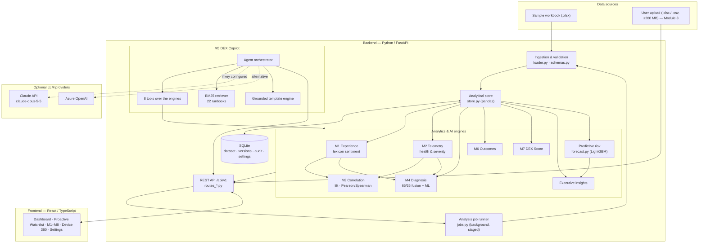
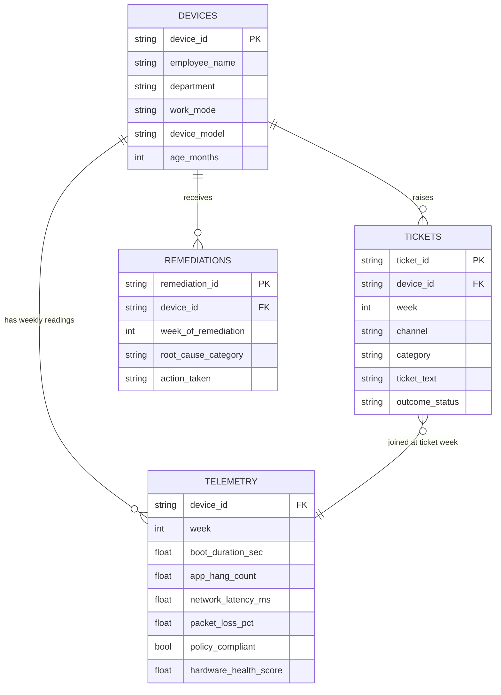
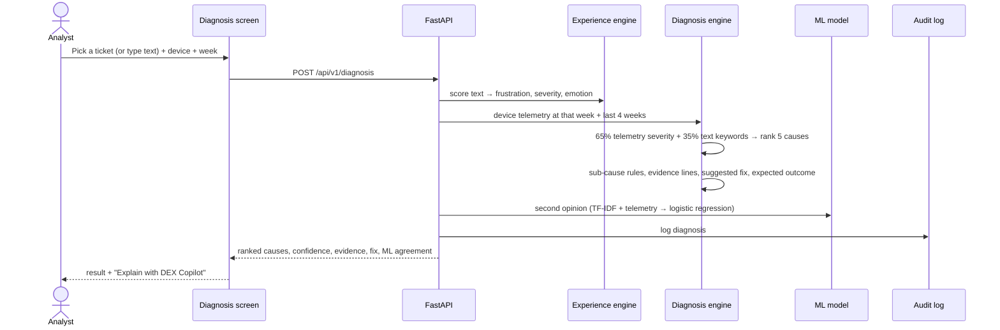
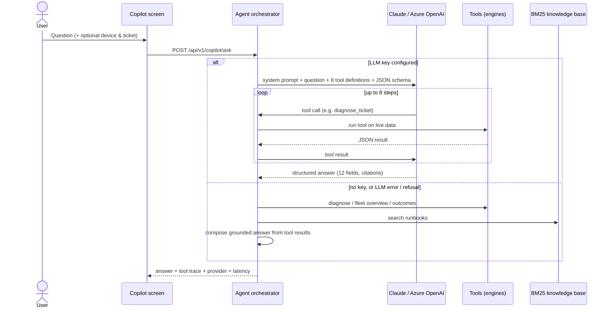
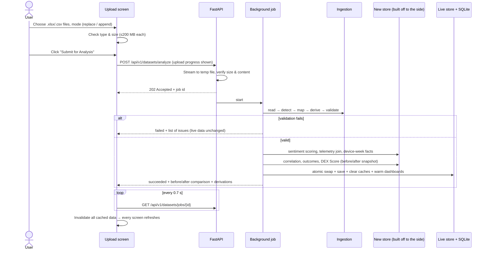
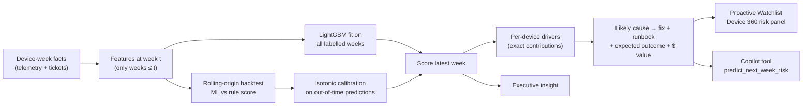

# DEX Sentinel: Complete Application Documentation

**Outcome-based Digital Employee Experience (DEX) analytics platform**
*Correlates employee sentiment (tickets, calls, chats, repeat contacts) with endpoint telemetry (boot time, application hangs, network quality, policy state, hardware health) to improve diagnosis, remediation and outcome-based reporting, and uses machine learning to **predict which employees will have a frustrating week before they call**.*

> **Data notice:** the bundled dataset is fully simulated. No real employee or endpoint data is used.

> **What's new in this version: Predictive DEX ("Fix it before they call").** A LightGBM model forecasts next week's frustrated tickets from telemetry trends. It explains each prediction, recommends the runbook fix, and prices the tickets a proactive fix avoids. On a reproducible 5,000-device benchmark it catches **72%** of next-week frustrated tickets from the top 5% of devices, against **49%** for the rule-based score. See [9.9](#99-predictive-risk-model-fix-it-before-they-call) and [10.4](#104-predictive-model-evaluation).
>
> **Presenting to a jury?** The pitch, talk track and Q&A are in [docs/PITCH.md](docs/PITCH.md). **Presenting to engineers?** Architecture, the metrics catalogue with worked examples, and 34 technical FAQs are in [docs/TECHNICAL_BRIEF.md](docs/TECHNICAL_BRIEF.md).
>
> **Email-driven software removal:** an MCP server turns security-team emails into version-specific, human-approved removals on the simulated fleet, with rollback and a tamper-evident audit log. See [docs/REMEDIATION_MCP.md](docs/REMEDIATION_MCP.md).

---

## Table of contents

1. [DEX Sentinel in plain English](#1-dex-sentinel-in-plain-english)
2. [The problem it solves](#2-the-problem-it-solves)
3. [Key terms (glossary)](#3-key-terms-glossary)
4. [What the application does: the 8 modules](#4-what-the-application-does-the-8-modules)
5. [Technology stack](#5-technology-stack)
6. [Architecture](#6-architecture)
7. [Data model](#7-data-model)
8. [Step-by-step flow of the application](#8-step-by-step-flow-of-the-application)
9. [Approaches, algorithms and formulas](#9-approaches-algorithms-and-formulas)
10. [Where AI is used: LLMs and machine learning](#10-where-ai-is-used-llms-and-machine-learning)
11. [Screen-by-screen user guide](#11-screen-by-screen-user-guide)
12. [API reference](#12-api-reference)
13. [Validation, testing and performance](#13-validation-testing-and-performance)
14. [Security and production readiness](#14-security-and-production-readiness)
15. [Installing and running](#15-installing-and-running)
16. [Configuration reference](#16-configuration-reference)
17. [Project structure](#17-project-structure)
18. [Assumptions and limitations](#18-assumptions-and-limitations)
19. [Future roadmap](#19-future-roadmap)
20. [FAQ](#20-faq)

---

## 1. DEX Sentinel in plain English

When an employee calls the IT service desk and says *"Outlook keeps crashing and this is unacceptable"*, two things are true:

- **What the employee says:** they are frustrated, and they describe a symptom.
- **What their laptop is doing:** it has objective measurements such as 9 application hangs this week, a normal boot time and a compliant security policy.

Most IT teams look at these two sources separately, or not at all. DEX Sentinel puts them side by side. It does five things:

1. It **reads the employee's words** and scores how frustrated they are (0–100).
2. It **reads the device's health data** and scores how badly the device is performing.
3. It **correlates the two** to find which technical problems cause the most frustration, and on a single ticket, **which root cause is most likely**.
4. It **predicts who will struggle next week**. A machine-learning model watches each device's telemetry drift, for example boot time creeping up 60 seconds over three weeks, and flags the employee *before* they pick up the phone. It shows why and which fix to apply.
5. After a fix, it **proves whether the experience actually improved**, using numbers rather than "the ticket was closed".

A single **DEX Score** (0–100) summarises all of this for leadership. Module 8 lets you upload your own fresh data, and every screen re-analyses automatically.

---

## 2. The problem it solves

| Today's pain | Consequence | What DEX Sentinel does |
|---|---|---|
| "My laptop is slow" can mean five different technical causes | Long troubleshooting calls, trial-and-error fixes, reassignments | Ranks the likely root cause in seconds, using the ticket text **and** the device telemetry |
| Tickets close when the employee stops calling | Repeat contacts and hidden productivity loss | Measures the before/after on every fix: frustration, repeat contacts, ticket volume |
| Leadership sees SLA and closure metrics only | Investment decisions aren't tied to employee experience | Reports an outcome-based DEX Score, Experience Recovery % and business value in dollars |
| The service desk is reactive: it waits for the angry call | Employees lose hours before anyone knows; the first contact is already frustrated | **Predicts** next week's frustrated employees from telemetry trends and gives a ranked, explained, costed **Proactive Watchlist** |

---

## 3. Key terms (glossary)

| Term | Meaning |
|---|---|
| **DEX** | Digital Employee Experience: how well technology works for employees day to day. |
| **Telemetry** | Automatic measurements from a device, such as boot time, hangs, latency and battery health. |
| **Sentiment** | Whether text sounds positive, neutral or negative. |
| **Frustration Score** | 0–100 measure of how frustrated a ticket sounds, boosted by repeat contacts and escalations. |
| **Repeat contact** | The employee contacting the service desk again about the same issue. |
| **Escalation** | A ticket passed to a higher support tier. |
| **Device-week** | One device's telemetry for one week; the basic unit of analysis. |
| **Warn / critical threshold** | The readings at which a signal counts as degraded or severely degraded (for example, boot above 55 s is warn and above 85 s is critical). |
| **Correlation (r)** | A number from −1 to +1 showing how strongly two measures move together. 0.83 is strong. |
| **Lift** | How many times higher frustration is in the worst telemetry bucket than in the best one (for example, 1.9×). |
| **Remediation** | A fix applied to a device, such as a reimage, an app reinstall or a Wi-Fi adapter swap. |
| **Experience Recovery %** | (DEX Score after fix − before) ÷ before × 100. |
| **LLM** | Large Language Model, an AI that reads and writes natural language. Used optionally by the Copilot. |
| **RAG** | Retrieval-Augmented Generation: the AI looks up relevant documents (runbooks) before answering. |
| **Predictive risk** | The model's calibrated probability (0–100%) that a device's employee raises a *frustrated* ticket (frustration ≥ 60, i.e. High/Critical) **next week**. |
| **Proactive Watchlist** | Devices ranked by predictive risk, each with its drivers, likely cause, recommended fix and avoidable tickets. |
| **Driver** | A reason behind a prediction: the model's exact per-feature contributions, grouped into a readable signal (for example "Boot duration 108.9s, +61.3s over 3 wks"). |
| **LightGBM** | A fast gradient-boosted decision-tree library, widely used for tabular machine learning. |
| **Out-of-time backtest** | An honest test: train on weeks before *k*, predict week *k*, repeat for later weeks, so the model is only ever scored on weeks it has not seen. |
| **Recall / precision @ top 5%** | If the desk acts on the top 5% of devices each week: recall is the share of all next-week frustrated tickets caught; precision is the share of flagged devices that really did raise one. |
| **PR-AUC** | Ranking quality for rare events, from 0 to 1. Higher means true positives are concentrated at the top of the list. |
| **Calibration** | Whether "30% risk" really happens about 30% of the time. Checked by grouping predictions into deciles. |
| **Simulator** | `app.data.simulator`: generates large, seeded, realistic datasets in the upload schema for benchmarking. |

---

## 4. What the application does: the 8 modules

| # | Module | What you get | Key outputs |
|---|---|---|---|
| — | **Executive Dashboard** | One-page leadership view | DEX Score, Experience Recovery %, Correlation Score, business savings, trends, top drivers, generated insights (including the predictive insight), at-risk devices |
| ML | **Proactive Watchlist** *(new)* | Who will struggle next week, and what to do now | Calibrated next-week risk per device, risk band, top drivers, likely cause, recommended fix + runbook, avoidable tickets and $ value, ML-vs-rules backtest, driver importance, calibration chart |
| M1 | **Experience Analytics** | What employees are saying | Frustration Score (0–100), sentiment, emotion (Anger / Frustration / Anxiety / Inquiry / Neutral), severity (Low / Medium / High / Critical), Employee Experience Index |
| M2 | **Telemetry Intelligence** | What devices are doing | Device Health Score, Telemetry Severity Score, threshold breaches, fleet health bands, device list |
| M3 | **Correlation Engine** | What's actually driving frustration | Correlation score, severity lift, compliance incidence lift, correlation matrix, risk heatmap, impact ranking, experience drivers |
| M4 | **Diagnosis Assist + Root Cause Engine** | Root cause for a ticket + device | Ranked causes with likelihood and confidence, sub-cause, telemetry evidence, suggested fix, expected outcome, ML second opinion |
| M5 | **DEX Copilot** | Ask questions in plain English | Ticket summary, root-cause explanation, evidence, remediation steps, expected outcome, business impact, with citations |
| M6 | **Outcome Reporting** | Did the fix work? | Before vs after frustration, repeat-contact rate, tickets/week, DEX Score, Experience Recovery %, $ value, CSV export |
| M7 | **DEX Score** | The single outcome number, explained | Formula, 5 components, trends, cohort ranking, what-if simulator |
| M8 | **Upload Dataset** | Analyse new real-time data | Upload .xlsx/.csv (up to 200 MB per file), **Submit for Analysis**, before/after comparison, all screens refreshed |
| — | **Device 360** | Everything about one device | **Next-week risk panel** (risk %, why, proactive fix, risk history against what actually happened), telemetry history with the fix week marked, tickets, remediations |
| — | **Data & Settings** | Administration | Business-impact assumptions, AI model evaluation, API key |

---

## 5. Technology stack

### 5.1 Backend (server)

| Technology | Version | Used for |
|---|---|---|
| **Python** | 3.11+ (built and tested on 3.14) | Main language for all analytics and AI |
| **FastAPI** | 0.141 | REST API framework, request validation, OpenAPI docs at `/docs` |
| **Uvicorn** | 0.54 | High-performance ASGI web server |
| **Pydantic / pydantic-settings** | 2.13 / 2.15 | Request/response validation; configuration from environment variables |
| **pandas** | 3.0 | Data tables, joins, aggregations (the analytical store) |
| **NumPy** | 2.5 | Vectorised numeric computation |
| **SciPy** | 1.18 | Statistics: Pearson and Spearman correlation, p-values |
| **scikit-learn** | 1.9 | Machine learning: TF-IDF text features, logistic regression, cross-validation, isotonic calibration, evaluation metrics |
| **LightGBM** | 4.7 | Gradient-boosted trees for the predictive risk model, with native per-prediction feature contributions |
| **SQLAlchemy** | 2.1 | Database access (SQLite by default; Postgres-ready) |
| **SQLite** | built into Python | Persists the dataset, dataset versions, audit logs and settings |
| **openpyxl + python-calamine** | 3.1 / 0.8 | Reading Excel workbooks (calamine is about 9× faster for large files) |
| **python-multipart** | 0.0.32 | File uploads |
| **anthropic** (Claude SDK) | 1.9 | Optional LLM provider for DEX Copilot (default) |
| **openai** (Azure OpenAI SDK) | 3.20 | Optional alternative LLM provider |
| **pytest + httpx** | 9.1 / 0.28 | Automated tests |

### 5.2 Frontend (user interface)

| Technology | Version | Used for |
|---|---|---|
| **React** | 18.3 | UI framework |
| **TypeScript** | 5.6 | Type-safe JavaScript |
| **Vite** | 5.4 | Dev server (hot reload) and production build |
| **Recharts** | 2.15 | Charts: lines, bars, scatter |
| **TanStack React Query** | 5 | Data fetching, caching, automatic refresh after uploads |
| **React Router** | 6 | Page navigation (single-page app) |
| **lucide-react** | 0.460 | Icons |
| **react-markdown** | 9 | Renders Copilot answers and runbooks |
| Custom CSS design system | — | Dark and light themes; colour-blind-safe validated chart palette |

### 5.3 AI / ML components

| Component | Type | Technology |
|---|---|---|
| Sentiment and frustration scoring | Rule-based NLP (weighted keyword lexicon) | Pure Python |
| Emotion classification | Rule-based lexicon | Pure Python |
| Correlation analysis | Statistics | SciPy (Pearson, Spearman, t-test p-values), pandas |
| Root-cause engine (primary) | Explainable rule fusion (65% telemetry / 35% text) | Pure Python / NumPy |
| Root-cause second opinion | **Machine learning**: multinomial logistic regression on TF-IDF + telemetry features | scikit-learn |
| **Predictive risk ("fix before they call")** | **Machine learning**: gradient-boosted trees on telemetry trends + experience history, with isotonic calibration and per-prediction driver explanations | LightGBM, scikit-learn |
| Knowledge retrieval (RAG) | Okapi **BM25** ranking | Pure Python (no external service) |
| DEX Copilot | **LLM agent** with tool calling and structured output | Claude (`claude-opus-5-5`) or Azure OpenAI; offline grounded template engine |

### 5.4 Tooling and delivery

| Tool | Purpose |
|---|---|
| `run.ps1` / `run.sh` | One-command setup and launch (Windows / macOS / Linux) |
| `Dockerfile` | Container build: Node builds the UI, Python (Hypercorn, HTTP/2) serves API + UI |
| `deploy/gcp/` | Google Cloud Run deployment scripts (PowerShell + bash) and guide |
| `python -m app.data.simulator` | Generates a large seeded dataset (for example 5,000 devices × 26 weeks) as CSVs ready for Module 8 upload |
| ngrok | Optional: shares the local app with others (`ngrok http 5173`; Vite accepts `*.ngrok-free.app` hosts) |
| Git | Version control (the repository is initialised in the project folder) |
| Playwright + Microsoft Edge | End-to-end UI verification during development (not a runtime dependency) |

---

## 6. Architecture

### 6.1 Big picture (plain-text version)

```
                ┌───────────────────────────── DATA SOURCES ──────────────────────────────┐
                │  Service-desk tickets / calls / chats   Endpoint telemetry   Remediations │
                │  (bundled sample .xlsx, or your own .xlsx / .csv via Module 8 upload)     │
                └───────────────────────────────────┬──────────────────────────────────────┘
                                                    ▼
                ┌──────────────────── INGESTION  (data/loader.py) ─────────────────────────┐
                │ read → detect table → map column aliases → derive missing fields →        │
                │ roll up daily telemetry → validate → report warnings & derivations        │
                └───────────────────────────────────┬──────────────────────────────────────┘
                                                    ▼
                ┌───────────── ANALYTICAL STORE  (data/store.py, in memory) ───────────────┐
                │ tickets enriched with sentiment + telemetry at the ticket's week          │
                │ device-week fact table (health, severity, frustration burden)             │
                │ persisted to SQLite (db.py) · rebuilt and swapped atomically on upload    │
                └───────────────────────────────────┬──────────────────────────────────────┘
                                                    ▼
   ┌──────────────────────────────── ANALYTICS & AI ENGINES (engines/, copilot/) ──────────────────────────────┐
   │ M1 experience.py   M2 telemetry.py   M3 correlation.py   M4 diagnosis.py + ml.py                          │
   │ M5 copilot/ (agent + tools + BM25 RAG + LLM providers)   M6 outcomes.py   M7 dex_score.py   insights.py   │
   │ ML forecast.py: next-week risk (LightGBM + calibration + drivers), retrained in the background            │
   └──────────────────────────────────────────────────┬───────────────────────────────────────────────────────┘
                                                      ▼
                ┌──────────────── REST API  (FastAPI, /api/v1, api/*.py) ──────────────────┐
                │ validation · optional API key · caching · JSON · background upload jobs  │
                └───────────────────────────────────┬──────────────────────────────────────┘
                                                    ▼  HTTP / JSON
                ┌──────────── WEB UI  (React + TypeScript + Recharts, frontend/) ───────────┐
                │ Executive · Proactive Watchlist · M1–M8 · Device 360 · Settings          │
                └──────────────────────────────────────────────────────────────────────────┘
                          optional ▲ HTTPS
                ┌─────────────────┴─────────────────┐
                │ LLM: Claude API  or  Azure OpenAI │  (only for DEX Copilot answers)
                └───────────────────────────────────┘
```

### 6.2 Component diagram



### 6.3 Layers explained

| Layer | Responsibility | Key files |
|---|---|---|
| **Ingestion** | Turns messy real-world files into clean tables; reports what it changed | `backend/app/data/loader.py`, `schemas.py` |
| **Analytical store** | Holds the analysis-ready tables in memory, with fast per-device lookups | `backend/app/data/store.py` |
| **Persistence** | Saves dataset, versions, diagnosis and Copilot audit logs, settings | `backend/app/db.py` (SQLite by default) |
| **Engines** | All scoring, correlation, diagnosis, outcomes, DEX Score, predictive risk | `backend/app/engines/*.py` (`forecast.py` for prediction) |
| **Simulator** | Large seeded datasets for benchmarking and demos | `backend/app/data/simulator.py` |
| **Copilot** | Agent, tool registry, RAG, LLM providers, offline template | `backend/app/copilot/*.py`, `copilot/kb/*.md` |
| **API** | HTTP endpoints, validation, security, caching, background jobs | `backend/app/api/*.py`, `main.py`, `data/jobs.py` |
| **UI** | Screens, charts, filters, upload experience | `frontend/src/**` |

---

## 7. Data model

### 7.1 Input tables

| Table | One row per | Required columns | Optional columns (derived when missing) |
|---|---|---|---|
| **telemetry** | device per week (daily rows are rolled up) | `device_id`, `week` *(or a reading date)*, plus at least two signals | `week_start`, `boot_duration_sec`, `app_hang_count`, `network_latency_ms`, `packet_loss_pct`, `policy_compliant`, `hardware_health_score`, `battery_health_pct`, `disk_health_pct` |
| **tickets** | service-desk contact (call, chat, portal) | `ticket_id`, `device_id`, `ticket_text`, `week` *(or a ticket date)* | `channel`, `category` (inferred from text), `repeat_contact` / `repeat_number` (derived from history), `resolution_time_hours`, `outcome_status`, `employee_name`, `department`, `date` |
| **devices** | device | `device_id` | `employee_name`, `department`, `work_mode`, `device_model`, `age_months` (the whole table is derived from IDs if absent) |
| **remediations** | fix applied | `remediation_id`, `device_id`, `root_cause_category`, `action_taken`, `week_of_remediation` *(or a date)* | 16 `pre_*` / `post_*` metrics (calculated from the data if absent) |

Column names are matched flexibly. For example "Device ID", "Configuration Item" and "hostname" all map to `device_id`, and "Short Description" and "Transcript" map to `ticket_text`. The full alias list is in the M8 column guide.

### 7.2 Derived (analysis) tables

| Derived table | What it adds |
|---|---|
| **Enriched tickets** | Text score, frustration score, sentiment (−1..+1), sentiment tier, severity, emotion, the device's telemetry in that ticket's week, per-category severities, composite telemetry severity |
| **Device-week facts** | Ticket count, repeat contacts, escalations, crash events, average/max frustration, **Device Health Score**, **Telemetry Severity Score**, **frustration burden** (the highest frustration raised that week, 0 if no contact) |
| **Audit tables** | Every diagnosis, every Copilot answer (provider, latency), dataset versions, settings overrides |

### 7.3 Entity relationships



---

## 8. Step-by-step flow of the application

### 8.1 Overall journey

```mermaid
flowchart LR
    A["1 · Data arrives<br/>sample or upload"] --> B["2 · Ingest & validate"]
    B --> C["3 · Score sentiment<br/>& frustration (M1)"]
    C --> D["4 · Score device health<br/>& severity (M2)"]
    D --> E["5 · Join each ticket to<br/>its device's telemetry"]
    E --> F["6 · Correlate experience<br/>with telemetry (M3)"]
    F --> G["7 · Outcomes & DEX Score<br/>(M6, M7) + insights"]
    G --> P["7b · Predict next week's<br/>frustrated employees (ML)"]
    P --> H["8 · Dashboards & screens"]
    H --> I["9 · Act proactively on the watchlist,<br/>diagnose a ticket (M4) or ask Copilot (M5)"]
    I --> J["10 · Fix applied → upload<br/>new data (M8) → measure recovery"]
    J --> B
```



### 8.2 Step by step

1. **Start-up.** The server loads the bundled sample workbook the first time it runs, or the last saved dataset from SQLite on later runs. It builds the analytical store, loads the 22 runbooks, and pre-computes the heaviest dashboard views in the background.
2. **Ingestion.** Each file is read. Excel is read with calamine; CSV has its encoding and delimiter detected automatically. The header row is found even when there are title rows above it, and each sheet or file is recognised as telemetry, tickets, devices or remediations.
3. **Normalisation.**
   - Column names are mapped to the canonical names.
   - Dates become week numbers.
   - Daily readings are rolled up to device-weeks: levels are averaged, hangs are summed, and any non-compliant reading marks the week non-compliant.
   - Duplicates are removed and invalid values set aside.
   - Missing fields are derived.
   - Every change is written into a report.
4. **Sentiment scoring (M1).** Every ticket's text is scored. The result is the lexicon frustration score plus the repeat-contact and escalation boost, then the sentiment tier, severity and emotion.
5. **Telemetry scoring (M2).** For every device-week, each signal is compared with its warn/critical thresholds. That produces per-category severity, a composite Telemetry Severity Score and the Device Health Score.
6. **Join.** Each ticket is matched to its device's telemetry for the same week, or the nearest earlier week. This single step makes "what they said" and "what the device was doing" comparable.
7. **Correlation (M3).** The engine computes:
   - the Pearson/Spearman correlation matrix
   - severity lift per signal
   - policy incidence lift
   - the risk heatmap
   - the impact ranking
   - the language that drives frustration (experience drivers)
8. **Outcomes and DEX Score (M6, M7).** Before/after metrics are calculated for each remediation, then the DEX Score for any group and window, Experience Recovery %, business value and the executive insights.
   - **Prediction (ML).** For every device-week the forecaster builds trend features from weeks up to and including that week. It backtests itself out-of-time against the rule score, trains LightGBM on all labelled weeks, calibrates the risk, and scores the latest week to produce next week's watchlist. This runs in the background at start-up and after every upload.
9. **Presentation.** The React UI calls the API. Results are cached, and the global filters (department, device model, work mode, week range) re-scope every analytics screen.
10. **Action.** An analyst works the Proactive Watchlist before employees call, diagnoses a ticket (M4) or asks the Copilot (M5), applies the recommended fix, then uploads new data (M8). Outcome Reporting shows whether the experience recovered.

### 8.3 Diagnosis flow (Module 4)



### 8.4 DEX Copilot flow (Module 5)



### 8.5 Upload and analysis flow (Module 8)



### 8.6 Predictive flow: "fix it before they call"



1. The label for week *t* is "did this device raise a frustrated ticket (frustration ≥ 60) in week *t + 1*?" The latest week has no label; it is the week being forecast.
2. The backtest trains on weeks before *k*, scores week *k*, and repeats for the last six weeks. The rule-based at-risk score is scored on the same weeks, so the two are compared fairly.
3. Out-of-time predictions fit an isotonic calibrator, so the risk % reads as a real probability.
4. The final model is trained on every labelled week and scores the latest week. For each device the top positive contributions become human-readable **drivers**.
5. The strongest telemetry driver maps to a likely category, fix and runbook. The historical ticket-rate reduction for that category, times the risk and the cost per ticket, gives the **avoidable value**.

---

## 9. Approaches, algorithms and formulas

### 9.1 Sentiment and frustration scoring (M1)

**Approach:** a transparent, weighted **keyword lexicon**, which is rule-based NLP rather than a black-box model. Every point in a score can be traced to a phrase. On the dataset it was validated at **93.3% agreement** with a hidden ground-truth label.

| Phrase group | Examples | Points each |
|---|---|---|
| Strong negative | "unacceptable", "can't get my work done" | +54 |
| High negative | "is urgent", "losing hours", "multiple times", "nothing has changed" | +35 |
| Medium negative | "frustrating", "second time", "keeps happening", "slowing me down" | +25 |
| Repeat markers | "following up again", "same issue as last week", "still not resolved" | +18 |
| Baseline | every ticket | 8 |

```
text_score        = min(100, 8 + Σ matched phrase weights)
frustration_score = min(100, text_score + 10 × prior_contacts + 15 × escalations)
```

- Negation is handled explicitly. "Not urgent" does **not** match "urgent", because the lexicon uses "is urgent".
- **Sentiment tier** (validated tiers): Low < 28 ≤ Medium < 62 ≤ High.
- **Experience severity** (spec tiers): Critical ≥ 80, High ≥ 60, Medium ≥ 40, otherwise Low.
- **Sentiment polarity** (−1 to +1): negative phrases pull the value down; calm phrases ("quick question", "not urgent") push it up.
- **Emotion:** separate lexicons for **Anger**, **Frustration**, **Anxiety** and **Inquiry**, weighted and normalised into a distribution. The primary emotion is the highest; **Neutral** applies when nothing matches.

*Example:* "This is unacceptable at this point. Outlook keeps crashing." gives 8 + 54 = **62/100**: High tier, severity High, emotion Anger.

### 9.2 Telemetry intelligence (M2)

| Signal | Warn | Critical | Direction |
|---|---|---|---|
| Boot duration | 55 s | 85 s | higher is worse |
| Network latency | 90 ms | 160 ms | higher is worse |
| Packet loss | 1.5 % | 3.5 % | higher is worse |
| App hangs / week | 3 | 6 | higher is worse |
| Hardware health | 68 | 52 | lower is worse |
| Battery health | 60 % | 45 % | lower is worse |
| Disk health | 70 % | 55 % | lower is worse |
| Policy compliance | — | non-compliant | binary |

- **Category severity:** 0 at warn, 1 at critical, capped at 1.3. It is computed for Performance (boot), Network (the worse of latency and packet loss), Login/Auth (non-compliance), Hardware and Application Crash (hangs).
- **Telemetry Severity Score** (0–100) = 100 × (60% × worst category + 40% × average category) ÷ 1.3.
- **Device Health Score** (from the requirements spec):

```
score = 100 − 0.1·boot_sec − 3·app_hangs − 4·crash_events − 0.05·latency_ms
DHS   = clip(0.8·score + 0.2·hardware_health, 0, 100)
```

- Unmeasured signals count as "not measured": they never raise severity or lower health.
- Derived signals: *crash events* are Application-Crash tickets in that device-week, and *VPN failure weeks* are weeks with packet loss ≥ 1.5%.
- Health bands: Healthy ≥ 80, Degraded 65–80, Poor < 65.

### 9.3 Correlation engine (M3): how the sentiment correlation works

Several complementary statistical methods are used, each suited to a different kind of signal:

1. **Ticket ↔ telemetry join.** Every ticket carries its device's telemetry from the same week, so each row pairs "what was said" with "what the device was doing".
2. **Correlation Score.** A Pearson correlation between ticket frustration and the composite Telemetry Severity. On the sample: **r = 0.83** (strong, n = 326); at device-week level **r = 0.64** (n = 3,120).
3. **Correlation matrix.** Eight experience signals (frustration, text score, repeat contacts, escalation, weekly burden, ticket volume, and more) against nine telemetry signals. Each cell shows **Pearson r**, **Spearman ρ** (rank-based, robust to outliers) and a **p-value** from a t-test (t = r·√((n−2)/(1−r²))). Very large datasets are correlated on a random sample of 250,000 rows.
4. **Severity lift** (continuous signals). Tickets are grouped into buckets by telemetry reading (for example boot < 30 s, 30–55, 55–85, > 85 s). Lift = average frustration in the worst bucket ÷ in the best bucket. Sample results: boot **1.9×**, latency **1.9×**, app hangs **1.8×**, hardware health **1.6×**.
5. **Incidence lift** (binary policy compliance). Non-compliance determines *whether* a login ticket happens rather than how angry it is, so the engine compares the share of device-weeks producing a Login/Auth ticket. Sample: **28.5%** of non-compliant weeks vs **0%** of compliant weeks (∞ lift).
6. **Risk heatmap.** Cohort (department, device model or work mode) × signal. Risk = breach rate × average frustration when breached, indexed to 100. A second heatmap shows frustration by cohort and week.
7. **Impact ranking.** For each telemetry driver:

   ```
   excess tickets = tickets on breached device-weeks − (healthy-week ticket rate × breached device-weeks)
   impact         = excess tickets × (avg frustration / 100) × (1 + repeat-contact share)
   ```

8. **Experience drivers.** Which phrases, channels, categories, emotions and behaviours (repeat contact, escalation) carry the most frustration.

### 9.4 Root cause engine (M4)

**Stage 1, category fusion** (explainable):

```
for each category (Performance, Network, Login/Auth, Hardware, Application Crash):
    telemetry_part = category severity ÷ 1.3             (0..1)
    text_part      = keyword hits for category ÷ max hits (0..1)
    fused          = 0.65 × telemetry_part + 0.35 × text_part
likelihood = fused ÷ Σ fused              (shares add up to 100%)
confidence = 100 × fused  (+ up to 10 if the breach persisted over recent weeks), max 99
```

**Stage 2, sub-cause rules.** Within the winning category, rules use the ticket wording, device attributes and telemetry trends. For example, an Outlook crash that keeps recurring points to *mail profile corruption*; a rising hang trend points to a *memory leak*; a remote worker mentioning "home" points to *home ISP quality*. Each sub-cause links to a fix and a runbook ID.

**Stage 3, evidence and outcome.**
- Telemetry evidence lines show the reading, fleet median, thresholds and how many of the last 4 weeks were breached.
- The expected outcome comes from past remediations of the same category (for example repeat contacts −100%, ticket rate −64%).
- **Guardrail:** when there is no telemetry anomaly and no symptom keyword, the result is flagged *inconclusive* instead of forcing a fix.

*Example (TCK-00002, week 6):* Application Crash, **100% likelihood, 99% confidence**. Evidence: 9 app hangs (critical above 6), breached 3 of the last 4 weeks. Fix: **Reinstall and patch the affected application** (KB-APP-001).

### 9.5 DEX Score (M7)

```
DEX = 0.35·EEI + 0.25·DHS + 0.20·RSS + 0.10·TRE + 0.10·STS
```

| Component | Definition | Sample value |
|---|---|---|
| **EEI**, Employee Experience Index | 100 − average weekly frustration burden per employee-week | 94.3 |
| **DHS**, Device Health Score | average Device Health Score | 90.5 |
| **RSS**, Remediation Success Score | 100 × (1 − repeat-contact rate), with repeats recounted inside the window | 54.0 |
| **TRE**, Ticket Resolution Efficiency | average of (resolved first time) × (SLA attainment, 8 h default) | 78.4 |
| **STS**, Sentiment Trend Score | 50 − 50·tanh(weekly burden slope ÷ 10). 50 means flat; above 50 means improving | 50.3 |

Sample fleet DEX Score: **79.3 (Good)**. Bands: Excellent ≥ 85, Good ≥ 70, Fair ≥ 55, Poor < 55. The score can be computed for the fleet, a department, a device model, a work mode or a single device, over any week range.

### 9.6 Outcome reporting (M6)

- **Windows:** *before* is the weeks before the remediation week; *after* is the remediation week onward. Repeat contacts are recounted inside each window, so a pre-fix ticket can't make a post-fix one look like a repeat.
- **Experience Recovery %** = (DEX after − DEX before) ÷ DEX before × 100. The spec example of 52 → 78 gives 50%.
- **Business impact:**
  - Tickets avoided per year = Σ (pre ticket rate − post ticket rate) × 52.
  - Support savings = tickets avoided × cost per ticket ($22 default).
  - Productivity = tickets avoided × average resolution hours × 50% loss × $55/h.
- Sample results across 46 fixes:
  - Frustration **69.0 → 58.2**
  - Repeat contacts **46.8% → 0.7%**
  - Tickets/week **0.41 → 0.15**
  - **45 of 46** improved
  - DEX **64.0 → 87.6 (+36.9%)**
  - Value about **$114,734/year**
- Cases with only 1–2 post-fix tickets are flagged (`n=`); the aggregate is the reliable read.

### 9.7 Executive insights

Generated sentences, each tied to a metric:
- sentiment tracks telemetry
- the #1 driver
- non-compliance generates login tickets
- the DEX trend
- remediation recovery
- annualised value
- the lowest-scoring department
- **predictive:** "N devices likely to raise a frustrated ticket in week W", with the backtest recall against the rules

### 9.8 Handling real-world uploads (M8)

- Alias-based column mapping.
- Automatic table detection.
- Dates converted to weeks.
- Daily-to-weekly roll-up.
- Category inferred from the ticket text using the same keyword model as diagnosis.
- Repeat number derived from device + category history.
- Devices derived from IDs; remediation before/after metrics calculated from the data.
- Status values normalised ("Closed" becomes Resolved).
- Unmeasured signals skipped.

### 9.9 Predictive risk model ("fix it before they call")

**Question answered:** *which employees will raise a frustrated (High/Critical) ticket next week, and what should we fix today to stop it?*

| Aspect | Detail |
|---|---|
| **Target** | 1 if the device raises a ticket with frustration ≥ 60 in week *t + 1*, else 0 |
| **Telemetry features** (8 signals: boot, hangs, latency, packet loss, non-compliance, hardware, battery, disk) | For each signal: current value, change vs last week, change vs the 3-week trailing mean, 4-week slope, weeks breached in the last 4 |
| **Experience features** | Tickets now and over the last 4 weeks, peak frustration (now and 4-week), repeat contacts and escalations (4-week), weeks since the last ticket, weeks since the last fix |
| **Device profile** | Age in months, work mode, department, device model (native categoricals) |
| **Deliberately excluded** | The composite Telemetry Severity and Device Health scores. They are functions of the raw signals, and keeping them would credit "severity" instead of naming the signal that actually moved |
| **No leakage** | Every feature at week *t* uses only weeks ≤ *t*. An automated test changes all future weeks and asserts that the features are unchanged |
| **Model** | LightGBM classifier (250 trees, learning rate 0.05, 31 leaves, row and column subsampling) |
| **Calibration** | Isotonic regression fitted on the out-of-time backtest predictions |
| **Explanation** | LightGBM `pred_contrib`: exact per-feature contributions (they sum to the model's raw score), grouped by signal into drivers with plain-language text |
| **Recommended fix** | Strongest positive telemetry driver → category and runbook (boot → KB-PERF-001, disk → KB-HW-002, latency → KB-NET-001, packet loss → KB-NET-002, non-compliance → KB-AUTH-001, hardware → KB-HW-003, battery → KB-HW-001, hangs → KB-APP-001). With no telemetry driver: a proactive check-in (KB-GEN-001) |
| **Risk bands** | High ≥ 50% · Elevated ≥ 25% · Watch ≥ 10% · Low |
| **Guardrails** | Needs ≥ 6 weeks and ≥ 30 frustrated tickets, otherwise it explains why it is unavailable. A **low-sample** banner appears when the backtest has fewer than 200 positives |
| **Retraining** | Automatic in the background at start-up and after each upload (about 30 s for 5,000 devices × 26 weeks) |

```
avoidable tickets (device) = risk × ticket-rate reduction of past fixes in that category
cost per ticket            = cost_per_ticket_usd + avg resolution hours × productivity_loss_factor × hourly_employee_cost_usd
value per week (top N)     = Σ avoidable tickets × cost per ticket      (× 52 for "if sustained")
```
- Every derivation is listed for the user.

---

## 10. Where AI is used: LLMs and machine learning

### 10.1 Summary

| Question | Answer |
|---|---|
| **Is an LLM used for sentiment scoring or correlation?** | **No.** Sentiment is a validated, explainable keyword lexicon; correlation is classical statistics (Pearson, Spearman, lift). Every number is reproducible and auditable. |
| **Is machine learning used?** | **Yes, in two places.** (1) **Predictive risk**: a **LightGBM** model forecasts next week's frustrated tickets from telemetry trends, with calibrated risk and per-device explanations. It is measured against the rule baseline in an out-of-time backtest ([10.4](#104-predictive-model-evaluation)). (2) A **second opinion** for root cause: multinomial **logistic regression** on **TF-IDF** text plus standardised telemetry (scikit-learn). The explainable rule engine stays primary for diagnosis. |
| **Is an LLM used anywhere?** | **Yes, optionally, in DEX Copilot (M5)** to write business-language answers. It must call the app's tools to get every number. |
| **Which LLM?** | **Anthropic Claude**, model **`claude-opus-5-5`** (default when `ANTHROPIC_API_KEY` is set), or **Azure OpenAI** (your deployment). |
| **What if there's no LLM key?** | The Copilot uses the **grounded template engine**, which calls the same tools and returns the same answer format. The whole app works offline. |

### 10.2 Machine learning: root-cause second opinion

| Aspect | Detail |
|---|---|
| Algorithm | Multinomial logistic regression (scikit-learn `LogisticRegression`, C = 4) |
| Features | TF-IDF of ticket text (unigrams + bigrams, sublinear TF) + 8 standardised telemetry features at the ticket's week |
| Training data | Tickets with a known category (excluding "Other"), capped at 20,000 per training run |
| Evaluation | 5-fold stratified cross-validation, top-1 accuracy |
| Sample results | Rule engine 100%, fused ML 99.6%, text-only ML 100%, telemetry-only ML 99.6% (n = 277). This is high because the simulated data is cleanly separable; real-world accuracy will be lower. |
| Explainability | The top contributing features are shown (for example `telemetry:app_hang_count`) |
| Retraining | Automatic after each upload, in the background |

### 10.3 LLM: DEX Copilot design

| Aspect | Detail |
|---|---|
| Pattern | **Agentic tool use**: the LLM decides which tools to call, up to 8 steps |
| Tools (8) | `score_ticket_text`, `get_device_profile`, `diagnose_ticket`, `search_knowledge_base`, `get_remediation_outcomes`, `get_fleet_overview`, `find_at_risk_devices`, **`predict_next_week_risk`** (ML watchlist with drivers, fix and backtest accuracy; the offline template engine uses it too) |
| Grounding rule | System prompt: every number must come from a tool result; correlation isn't causation; the data is simulated |
| Output | **Structured JSON** (schema-enforced) with 12 fields: ticket summary, executive summary, primary driver, root-cause explanation, supporting evidence, recommended fix, remediation steps, expected outcome, business impact, confidence, answer, citations |
| RAG | 22 remediation runbooks (Markdown) ranked with **BM25**, boosted when the category or sub-cause matches; the answer cites article IDs such as KB-APP-003 |
| Claude settings | Model `claude-opus-5-5`, effort `medium`, prompt caching on the system prompt, server-side refusal fallbacks enabled |
| Failover | Authentication, rate-limit, network, refusal or malformed output triggers the grounded template engine automatically, and the UI shows why |
| Audit | Every Copilot call is logged (provider, question, answer, latency) |

### 10.4 Predictive model evaluation

**Benchmark (reproducible):** 5,000 devices × 26 weeks generated with `python -m app.data.simulator --devices 5000 --weeks 26 --seed 7`, uploaded through Module 8. Rolling-origin backtest over weeks 20–25 (30,000 device-weeks, 820 frustrated tickets, base rate 2.2%). Operating point: act on the **top 5% of devices each week**.

| Metric | ML (LightGBM) | Rules (current at-risk score) | Lift |
|---|---|---|---|
| **Next-week frustrated tickets caught** (recall @ top 5%) | **72.3%** | 48.8% | **1.48×** |
| Precision of flagged devices | **39.5%** | 26.7% | 1.48× |
| PR-AUC | **0.455** | 0.250 | 1.8× |
| ROC-AUC | **0.957** | 0.929 | — |
| Brier score (calibrated) | 0.018 | — | — |

- **Calibration:** predicted and observed rates match by decile (top decile 25.6% predicted vs 25.6% observed).
- **For comparison, a plain threshold rule** (any signal past warn) flags 13.5% of devices at only 18.7% precision.
- **Live example from the benchmark:** 185 devices at elevated risk for week 27, about 106 frustrated tickets expected fleet-wide, and a top-50 watchlist worth about **$3,699 per week (~$192k/yr if sustained)** at the default cost assumptions.
- **Another dataset (2,600 devices):** 32.6% vs 16.8% caught, about **2× the rules**. The lift holds even where absolute numbers differ.
- **Honest disclosure:** the data is simulated, with a hidden latent degradation state and a per-employee tolerance the model cannot see. The benchmark proves the method, not real-world accuracy. The bundled 260-device sample is flagged **low sample**.

---

## 11. Screen-by-screen user guide

Open the app (see [section 15](#15-installing-and-running)). Use the **filter row** at the top (department, device model, work mode, week range) to scope the analytics screens. Every chart has a **Table** button that shows the underlying numbers. The sun/moon button switches between light and dark themes.

| Screen | What you see | How to use it |
|---|---|---|
| **Executive Dashboard** | DEX Score with its five components, Experience Recovery, business value, Correlation Score, at-risk devices, DEX and frustration trends, top telemetry and language drivers, generated insights (including "N devices likely to raise a frustrated ticket next week"), department ranking, before/after summary | Start here. Click an at-risk device to open its Device 360, or **Next-week ML forecast →** for the watchlist. |
| **Proactive Watchlist** *(new)* | KPIs (devices at elevated risk, expected frustrated tickets, share caught a week early vs rules, avoidable value), the ML-vs-rules backtest, driver importance, the ranked watchlist (risk, band, why, likely cause, proactive fix + runbook, avoidable tickets), calibration chart | Filter by department and choose Top 25/50/100. Click a device to see its risk history and fix. |
| **M1 Experience Analytics** | Ticket KPIs, frustration by week, severity, emotion, the repeat-contact ladder (frustration rises with each repeat), channel/category breakdowns, a live text analyser, a ticket explorer | Paste any text into the analyser to see its score and which phrases fired. |
| **M2 Telemetry Intelligence** | Device health KPIs, weekly signal trends, threshold breaches, health bands, device model comparison, a searchable device fleet table | Sort by risk to find devices to fix proactively. |
| **M3 Correlation Engine** | Correlation score, lift cards, frustration by severity bucket, compliance incidence, impact ranking, correlation matrix, risk and frustration heatmaps, scatter with trend line | Switch the score basis; change the heatmap grouping; pick a signal for the scatter. |
| **M4 Diagnosis Assist** | Intake (ticket, device, week, repeats, escalations) and engine output (frustration, ranked causes, sub-cause, evidence, fix, expected outcome, ML opinion), plus the device vitals and ticket history | Pick a ticket and click **Run diagnosis**, then **Explain with DEX Copilot**. |
| **M5 DEX Copilot** | Chat with structured answers, citations, a tool-call trace and the knowledge-base browser | Try a suggested question, or add a device and ticket for a root-cause answer. |
| **M6 Outcome Reporting** | Experience Recovery, cases improved, value, before/after KPIs, DEX by root cause, business impact, the case register | Filter by root cause; **Export CSV**. |
| **M7 DEX Score** | Formula and definitions, what-if simulator, component trends, cohort ranking | Move the sliders to see how improving a component changes the score. |
| **M8 Upload Dataset** | Upload area, active dataset card, stage-by-stage progress, before/after comparison, derivations, column guide with CSV templates, upload history | Drop files, choose **Replace** or **Append**, click **Submit for Analysis**. |
| **Device 360** | Latest vitals; **next-week risk** (risk %, why, proactive fix, expected outcome) and **risk history** (out-of-time predictions against whether a frustrated ticket actually followed); weekly charts with the fix week marked; remediations with before/after; ticket history | Click **Diagnose latest ticket**. |
| **Data & Settings** | Dataset summary, business-impact assumptions, AI model evaluation (root-cause models **and** the predictive model vs rules), Copilot status, API key | Adjust the cost assumptions; business value and watchlist value recalculate. |

---

## 12. API reference

Base URL: `http://<host>:<port>/api`. Interactive documentation: **`/docs`**. If `DEX_API_KEY` is set, send the header `X-API-Key`. Analytics GET endpoints accept the filters `department`, `device_model`, `work_mode`, `week_from` and `week_to`.

| Method | Path | Purpose |
|---|---|---|
| GET | `/health` | Health check |
| GET | `/v1/meta` | Dataset version, counts, filter values, thresholds |
| GET | `/v1/dashboard/executive` | Executive Dashboard |
| GET | `/v1/experience/summary` | M1 summary |
| GET | `/v1/experience/tickets` | Ticket search/paging (`q`, `severity`, `emotion`, `channel`, `category`) |
| POST | `/v1/experience/analyze` | Score any text |
| GET | `/v1/telemetry/summary` | M2 summary |
| GET | `/v1/telemetry/devices` | Device list (`q`, `band`, `sort`) |
| GET | `/v1/devices/{device_id}` | Device 360 |
| GET | `/v1/correlation/analysis` | M3 (`score=frustration \| text`) |
| GET | `/v1/correlation/heatmap` | Risk and frustration heatmaps (`by=department \| device_model \| work_mode`) |
| GET | `/v1/correlation/scatter` | Ticket scatter (`signal=…`) |
| POST | `/v1/diagnosis` | M4 diagnosis |
| GET | `/v1/diagnosis/recent` | Diagnosis audit log |
| GET | `/v1/models/metrics` | ML and rule-engine evaluation (now includes `forecast`) |
| GET | `/v1/forecast/watchlist` | **Predictive** watchlist for next week (`top` 1–500, `department`): summary, ranked devices with drivers, fix, value, and model metrics |
| GET | `/v1/forecast/metrics` | Backtest (ML vs rules), calibration deciles, driver importance |
| GET | `/v1/forecast/devices/{device_id}` | One device's current risk + explanation and its risk history |
| POST | `/v1/copilot/ask` | M5 Copilot |
| GET | `/v1/copilot/status` | Active LLM provider |
| GET | `/v1/kb`, `/v1/kb/search`, `/v1/kb/{id}` | Runbooks |
| GET | `/v1/outcomes`, `/v1/outcomes/export.csv` | M6 report / CSV |
| GET | `/v1/dex-score` | M7 |
| GET / PUT | `/v1/settings` | Business-impact assumptions |
| POST | `/v1/datasets/analyze` | **M8** upload (`files`, `mode=replace \| append`) → job |
| GET | `/v1/datasets/jobs/{id}`, `/v1/datasets/jobs` | Job status / history |
| GET | `/v1/datasets/active` | Active dataset, coverage, metrics, history |
| GET | `/v1/datasets/schema` | Column guide |
| GET | `/v1/datasets/templates/{table}.csv` | CSV template |
| GET | `/v1/datasets/sample.xlsx` | Download the sample workbook |
| POST | `/v1/datasets/restore-sample` | Restore the sample dataset |

---

## 13. Validation, testing and performance

### 13.1 Validated numbers

The Python engines reproduce every figure published in the original judge briefing, and automated **golden tests** enforce them:

| Figure | Value |
|---|---|
| Severity lift: boot / latency / hangs / hardware | 1.9× / 1.9× / 1.8× / 1.6× |
| Login/Auth incidence: non-compliant vs compliant | 28.5% vs 0.0% |
| Remediation outcomes (46 cases) | frustration 69.0 → 58.2; repeat contacts 46.8% → 0.7%; tickets/week 0.41 → 0.15; 45/46 improved |
| Briefing example ticket | 62/100 High; Application Crash 100% |

### 13.2 Automated tests (81)

| Suite | Covers |
|---|---|
| `test_golden.py` | All published figures above |
| `test_engines.py` | Lexicon, negation, severity tiers, emotion, device health, fusion, DEX formula, Recovery % (52 → 78 = 50%), repeat logic |
| `test_api.py` | Every endpoint including the three `/forecast/*` routes, validation errors, settings, upload limits, API-key enforcement, Copilot schema, **mocked Claude tool-use loop**, refusal fallback |
| `test_upload.py` | Real-world style CSV (aliases, dates, daily roll-up, no categories), append mode, limits (type, size, mode), failed uploads leave live data untouched, restore sample |
| `test_forecast.py` *(new)* | **No leakage** (changing future weeks leaves features unchanged), label = next-week frustration, low-sample and too-little-history guardrails, **ML beats the rule baseline out-of-time** (ROC-AUC, PR-AUC, recall), contributions sum exactly to the model score, watchlist ranking and explanations |
| `test_simulator.py` *(new)* | Deterministic by seed, correct row counts, output passes upload validation |

Run them with `.\run.ps1 -Test`.

### 13.3 End-to-end and scale verification

- **Browser test** (Microsoft Edge driven by Playwright): invalid file rejected, then upload, **Submit for Analysis**, and results shown. Dashboard, correlation and telemetry all reflect the new data, the sample restores, and there are no page errors.
- **Scale test:** a **163 MB** upload (2.34 million device-weeks, 120,000 tickets) is analysed and live in about **80 seconds**. Each screen's first view at that size takes 3–14 s, then is cached.
- **Predictive benchmark:** the 5,000-device × 26-week simulated fleet (130,000 device-weeks, 6,080 tickets, 1,305 remediations) uploads and publishes in about 33 s. The forecaster then backtests and trains in the background in about 30 s, and the watchlist, Device 360 risk panel, Executive insight and Copilot tool were each verified end to end.

**Reproduce the benchmark:**

```powershell
cd backend
..\.venv\Scripts\python -m app.data.simulator --devices 5000 --weeks 26 --seed 7 --out ..\data\sim
# then open Upload Dataset, drop devices.csv, telemetry.csv, tickets.csv, remediations.csv → Submit for Analysis
# then open Proactive Watchlist (or GET /api/v1/forecast/metrics)
```

---

## 14. Security and production readiness

| Area | Measure |
|---|---|
| Access control | Optional `DEX_API_KEY`; the header is compared in constant time |
| Input validation | Pydantic models on every body and query parameter; length and pattern limits |
| Uploads | .xlsx/.csv only; content checked (real workbook / text CSV); 200 MB per file, 10 files; oversized requests rejected before parsing; temporary files deleted |
| Data safety | Uploads are built off to the side and swapped in only on success; dataset versions are recorded |
| Privacy | `DEX_MASK_PII=true` replaces employee names with pseudonyms |
| HTTP hardening | `X-Content-Type-Options`, `X-Frame-Options: DENY`, `Referrer-Policy`, CORS allow-list, JSON 404 for unknown API routes |
| Observability | Request IDs, structured access logs, diagnosis and Copilot audit tables |
| Reliability | Errors return JSON with a request ID; LLM failures fall back to the offline engine |
| Performance | Vectorised engines, positional per-device indexes, memoised views, start-up and post-upload cache warm-up, SQLite WAL mode |
| Deployment | Single container (Dockerfile) serving API + UI; Postgres supported via `DEX_DATABASE_URL` |

---

## 15. Installing and running

**Prerequisites:** Python 3.11+ and Node.js 18+.

### Windows (PowerShell)

```powershell
cd C:\PROJECTS\Hackathon\DEXSentimentCorrelation
.\run.ps1 -Port 8010        # installs everything, builds the UI, serves http://127.0.0.1:8010
.\run.ps1 -Dev -Port 8010   # development: API with auto-reload + UI on http://localhost:5173
.\run.ps1 -Test             # run the test suite
```

Port 8000 is the default. On this machine it is used by another application, so use `-Port 8010`.

### macOS / Linux

```bash
./run.sh 8010
```

### Docker

```bash
docker build -t dex-sentinel .
docker run -p 8080:8080 -e ANTHROPIC_API_KEY=... dex-sentinel
```

The container serves with **Hypercorn** (HTTP/2 capable) on `$PORT` (default 8080).

### Google Cloud (Cloud Run, demo tier)

```powershell
.\deploy\gcp\deploy.ps1 -ProjectId YOUR_PROJECT_ID      # or: ./deploy/gcp/deploy.sh YOUR_PROJECT_ID
```

This builds with Cloud Build and deploys one Cloud Run instance in asia-south1 with HTTP/2 (for 200 MB uploads),
secrets in Secret Manager, and a public URL protected by an access key. Visitors are prompted for the key in the UI.
Uploaded data resets on restart (demo tier). Full guide, costs, operations and troubleshooting:
[deploy/gcp/README.md](deploy/gcp/README.md).

### Load the large benchmark dataset (recommended for the predictive demo)

The bundled 260-device sample is too small for a meaningful predictive benchmark, and the page flags it as *low sample*. Generate the 5,000-device fleet ([13.3](#133-end-to-end-and-scale-verification)) and upload it through **Upload Dataset**. The first request to the watchlist after a restart or upload waits while the model trains (about 20–30 s); after that it is instant. **Restore sample dataset** returns to the bundled data.

### Share the app with others (ngrok)

```powershell
.\run.ps1 -Dev -Port 8010      # UI on :5173, API on :8010
ngrok http 5173                # share the https://…ngrok-free.app link
```

`frontend/vite.config.ts` allows any `*.ngrok-free.app` / `*.ngrok.app` host, so a fresh tunnel URL works without editing the config. Visitors click through ngrok's one-time warning page on the free plan.

### Enable LLM answers in the Copilot (optional)

Copy `.env.example` to `.env` and set `ANTHROPIC_API_KEY` (Claude) **or** the three `AZURE_OPENAI_*` variables. Restart the server.

---

## 16. Configuration reference

All settings are optional environment variables, and can also go in `.env`.

| Variable | Default | Meaning |
|---|---|---|
| `DEX_DATABASE_URL` | `sqlite:///data/dex_sentinel.db` | Database (any SQLAlchemy URL, e.g. Postgres) |
| `DEX_API_KEY` | *(unset)* | Require `X-API-Key` on API calls |
| `DEX_MASK_PII` | `false` | Pseudonymise employee names |
| `DEX_LLM_PROVIDER` | `auto` | `auto` \| `anthropic` \| `azure_openai` \| `template` |
| `ANTHROPIC_API_KEY` | *(unset)* | Enables Claude for the Copilot |
| `DEX_ANTHROPIC_MODEL` | `claude-opus-5-5` | Claude model |
| `DEX_ANTHROPIC_EFFORT` | `medium` | Claude effort level |
| `AZURE_OPENAI_ENDPOINT` / `_API_KEY` / `_DEPLOYMENT` | *(unset)* | Enables Azure OpenAI |
| `DEX_MAX_UPLOAD_MB` | `200` | Maximum size per uploaded file |
| `DEX_STORAGE_MODE` | `local` | `ephemeral` on the Cloud Run demo tier: M8 shows that uploads reset on restart |
| `DEX_MAX_UPLOAD_FILES` | `10` | Maximum files per upload |
| `DEX_COST_PER_TICKET_USD` | `22` | Business-impact assumption (also editable in the UI) |
| `DEX_HOURLY_EMPLOYEE_COST_USD` | `55` | Business-impact assumption |
| `DEX_PRODUCTIVITY_LOSS_FACTOR` | `0.5` | Share of resolution time the employee is impaired |
| `DEX_RESOLUTION_SLA_HOURS` | `8` | SLA used by Ticket Resolution Efficiency |
| `DEX_LOG_LEVEL` | `INFO` | Logging level |

---

## 17. Project structure

```
DEXSentimentCorrelation/
├── documentation.md          ← this document
├── README.md                 quick start
├── docs/SOLUTION.md          hackathon solution write-up (vision → roadmap, demo story)
├── docs/PITCH.md             jury pitch: talk track, demo script, proof points, Q&A
├── docs/TECHNICAL_BRIEF.md   engineering brief: stack, architecture, metrics + worked examples, technical FAQ
├── docs/REMEDIATION_MCP.md   software-remediation MCP server: tools, safety rules, demo inbox, config
├── run.ps1 / run.sh          one-command setup & launch
├── Dockerfile                container build
├── .env.example              configuration template
├── data/
│   └── DEX_Sentinel_Simulated_Dataset.xlsx   bundled sample (SQLite db created at runtime)
├── backend/
│   ├── requirements.txt
│   ├── app/
│   │   ├── main.py           FastAPI app, middleware, static UI serving, start-up warm-up
│   │   ├── config.py         settings
│   │   ├── db.py             SQLite / SQLAlchemy persistence & audit
│   │   ├── data/             schemas.py · loader.py (ingestion) · store.py (analytical store) · jobs.py (M8 jobs) · simulator.py (benchmark data)
│   │   ├── engines/          experience · telemetry · correlation · diagnosis · ml · forecast (predictive) · outcomes · dex_score · insights · thresholds
│   │   ├── copilot/          agent · tools · prompts · provider_anthropic · provider_azure · provider_template · retriever · kb/ (22 runbooks)
│   │   └── api/              routes_analytics · routes_ai · routes_datasets · routes_admin · deps
│   └── tests/                test_golden · test_engines · test_api · test_upload · test_forecast · test_simulator
├── frontend/
│   ├── package.json · vite.config.ts · index.html
│   └── src/
│       ├── main.tsx · api.ts · styles.css
│       ├── components/       Layout · ui (cards, tables, heatmaps, matrix) · charts
│       └── pages/            Executive · Proactive · Experience · Telemetry · Correlation · Diagnosis · Copilot · Outcomes · DexScore · Upload · Device · Settings
└── (original inputs)         masterprompt.md · requirements.md · DEX_Sentinel_Prototype.html · pitch deck · judge briefing
```

---

## 18. Assumptions and limitations

- **Simulated data.** The sample dataset was generated with known, seeded correlations so the method can be verified. Its near-perfect root-cause accuracy reflects clean synthetic data, not real-world performance.
- **Lexicon.** Validated at 93.3% on the dataset's language. Real ticket language will need re-tuning, and the lexicon is English-only.
- **Defaults, not fitted values.** The 65/35 fusion weights, severity thresholds and DEX component scalings are sensible starting points and should be calibrated on real outcomes.
- **Derived signals.** Crash events (from crash tickets), VPN failures (from packet loss) and sub-causes such as *memory leak* and *profile corruption* are inferred, not measured.
- **Correlation isn't causation.** Telemetry evidence supports a root cause but does not prove it.
- **Upload history** on the M8 screen is kept in memory until the server restarts; the datasets themselves are saved permanently.
- **Very large datasets** (millions of rows) take 3–14 s for each screen's first view; device-week correlations then use a 250,000-row sample.
- **Predictive benchmark is simulated.** The 72% vs 49% result shows the method on realistic synthetic data. On real data the model must be re-evaluated, and the built-in backtest does exactly that after every upload.
- **One-week horizon.** The model forecasts the next week only. Longer horizons are on the roadmap.
- **Prediction is correlational.** Drivers explain the model's reasoning, not proven causes. Diagnosis Assist confirms the fix before action.

---

## 19. Future roadmap

1. **Live connectors:** ServiceNow / Jira Service Management, Teams and telephony transcripts, DEX platforms (Nexthink, 1E, Intune Endpoint Analytics), with scheduled ingestion into Postgres.
2. **AI text understanding:** Claude labels ticket language (sentiment, emotion, frustration) and a small local embedding classifier is trained on those labels. It runs offline, keeps the lexicon as a fallback, and adds multilingual support. A paraphrase stress test will show where keyword rules break.
3. **Learn from outcomes:** fit thresholds, fusion weights and DEX scalings from confirmed diagnoses; retrain the predictive model from technician accept/reject feedback on the watchlist.
4. **Proactive remediation (started):** the predictive watchlist is live. Next, auto-trigger fix scripts for high-risk devices, with Copilot-drafted change and communication and human approval.
5. **Causal outcome measurement:** matched control devices (difference-in-differences) to report the true uplift of each fix type and recommend the best action per device.
6. **ITSM write-back:** push the diagnosis and a "Resolved: verified recovery" closure status back to the ticket.
7. **Enterprise hardening:** SSO / role-based access, row-level security by business unit, audit export, retention policies, transcript PII redaction.

---

## 20. FAQ

**Does it need the internet or an AI subscription?**
No. Everything, including the Copilot's grounded mode, runs locally. An LLM key only upgrades the Copilot's answers.

**Where does the AI "decide" things?**
Scores and correlations come from transparent rules and statistics. The predictive ML model ranks who to help first next week, and every ranking comes with its drivers. A second ML model gives a second opinion on root cause. The optional LLM only *explains*, using numbers it fetched from the app's tools.

**How is the prediction different from the existing at-risk list?**
The at-risk list is a fixed formula on current levels (60% telemetry severity + 40% frustration burden). The predictive model learns from *trends*: a boot time rising 20 s a week matters before it crosses a threshold. It also learns from each device's history, and it is calibrated. In the same backtest it catches 72% of next-week frustrated tickets against 49% for the formula.

**Can I reproduce the model numbers?**
Yes. Run the seeded simulator (`--seed 7`), upload the CSVs, and open the Proactive Watchlist or `GET /api/v1/forecast/metrics`. The automated tests also check that the model beats the rule baseline on unseen weeks.

**Can I use my own data?**
Yes. Use **M8 Upload Dataset**: `.xlsx` or `.csv`, up to 200 MB per file. Only telemetry and tickets are required, and common export column names are recognised automatically.

**What happens if my upload is wrong?**
The analysis stops, lists the problems, and the current data stays exactly as it was.

**How do I get back to the demo data?**
M8 → **Restore sample dataset**.

**How do I know the numbers are right?**
The golden tests reproduce every published figure, every chart has a table view, and every diagnosis shows its evidence and method.
